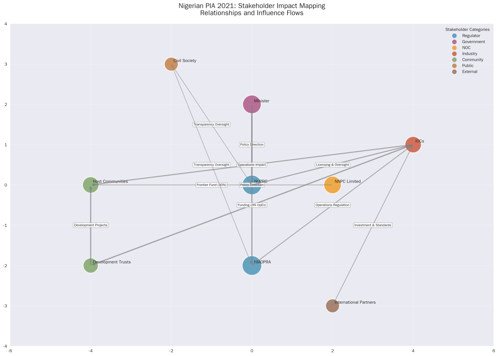
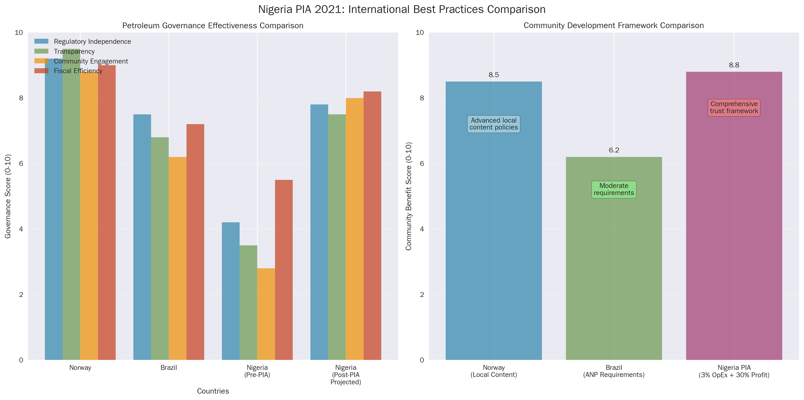
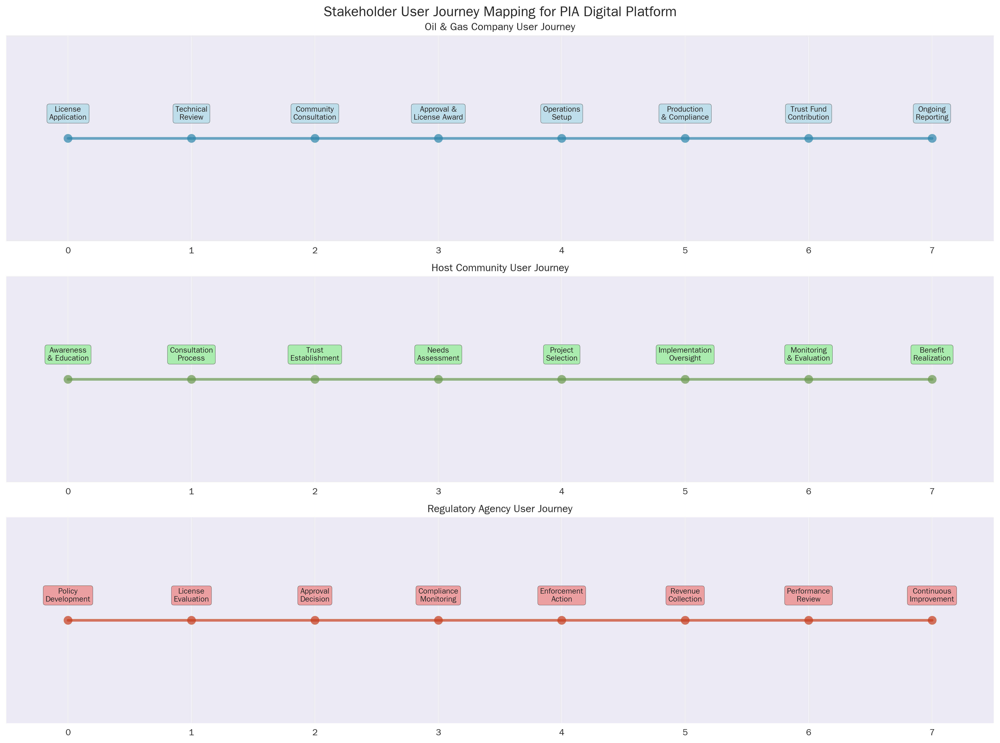
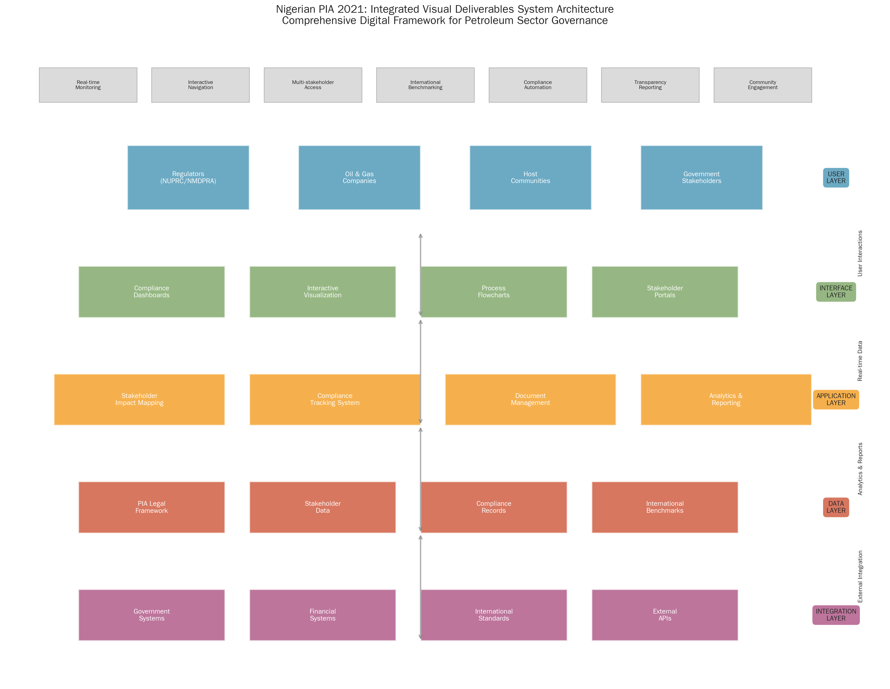
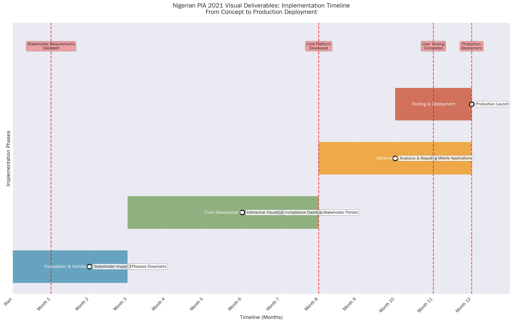
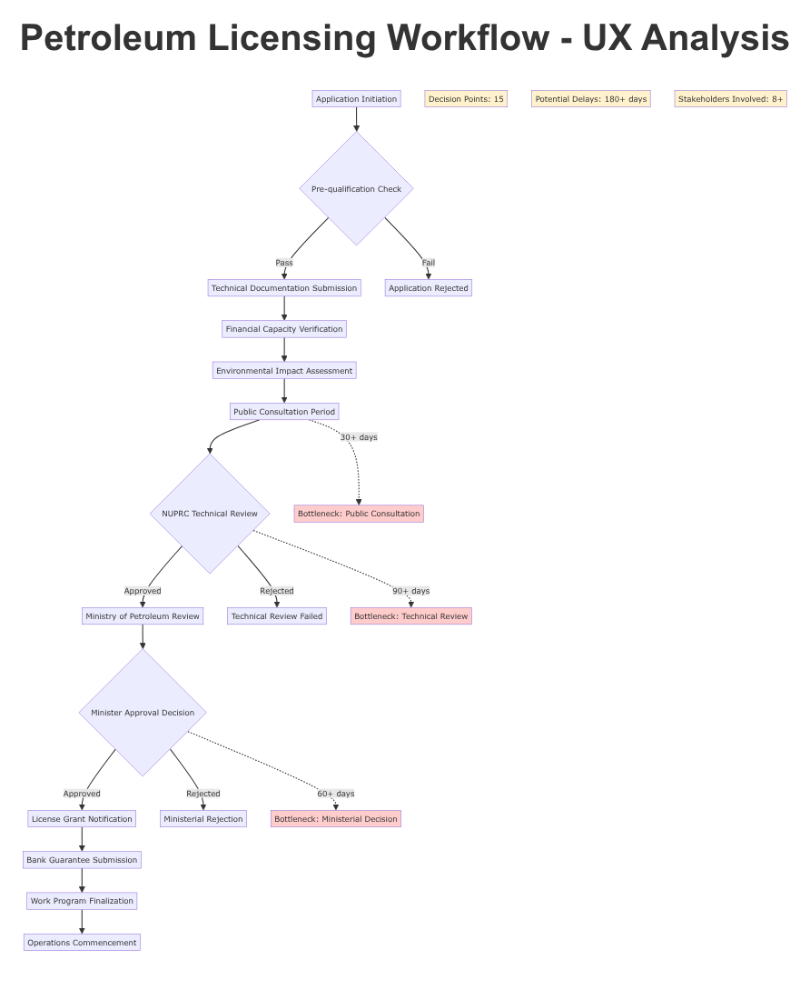
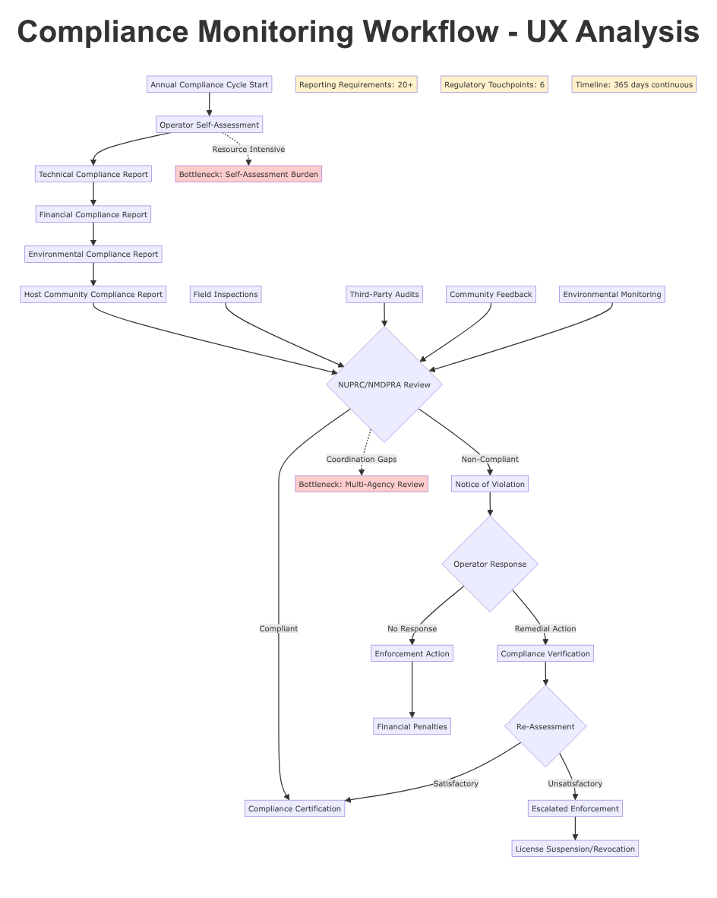
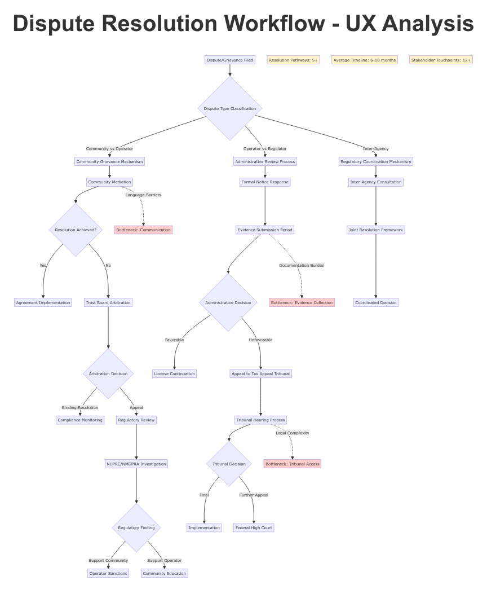
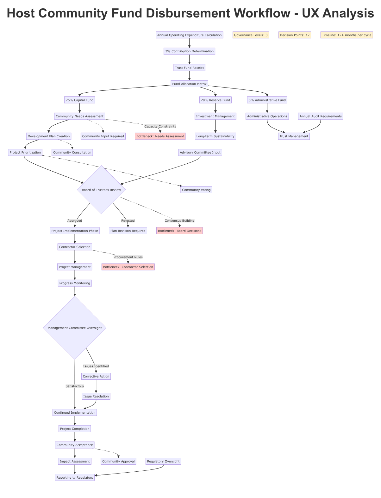

# Comprehensive UX Research Report for the Nigerian Petroleum Industry Act (PIA) 2021

## 1. Executive Summary

This report presents a comprehensive user experience (UX) analysis of Nigeria's Petroleum Industry Act (PIA) 2021, a landmark legislation poised to transform the nation's petroleum sector. Our research, encompassing a deep dive into the 319-section legal text, extensive stakeholder mapping, and international benchmarking against global leaders like Norway and Brazil, reveals both significant opportunities and critical usability challenges.

**Key Findings:**

*   **Transformative Potential:** The PIA establishes a modern regulatory architecture with the Nigerian Upstream Petroleum Regulatory Commission (NUPRC) and the Nigerian Midstream and Downstream Petroleum Regulatory Authority (NMDPRA). Its innovative fiscal and community development frameworks, including the 30% Frontier Exploration Fund and the 3% host community development trust contribution, have the potential to attract investment and foster sustainable development.
*   **Structural Complexity:** The Act's intricate structure, with extensive cross-referencing, presents a significant barrier to comprehension and navigation for all stakeholder groups, particularly non-expert users such as host communities.
*   **Stakeholder-Specific Needs:** Our analysis identifies five distinct stakeholder categories—Government/Regulators, Oil and Gas Companies, Host Communities, Civil Society, and International Partners—each with unique information requirements and interaction challenges.
*   **Critical Usability Gaps:** Key workflows, including licensing, compliance, and fund disbursement, are fraught with bottlenecks and procedural ambiguities that can lead to delays and disputes.

**Priority Recommendations:**

To unlock the full potential of the PIA and ensure its effective implementation, we recommend a series of strategic initiatives:

1.  **Develop a Unified Digital Platform:** Create a centralized, user-friendly digital portal for all PIA-related information and processes. This platform should feature a clear, intuitive interface with role-based access and functionality tailored to each stakeholder group.
2.  **Simplify and Translate:** Produce plain-language summaries and multilingual translations (initially in Hausa, Igbo, and Yoruba) of key sections, particularly those pertaining to host community rights and benefits.
3.  **Streamline Key Workflows:** Digitize and automate critical regulatory processes to enhance efficiency, transparency, and accountability. This includes creating interactive compliance checklists and online application portals.
4.  **Empower Host Communities:** Develop targeted educational materials, including visual guides and mobile-friendly resources, to ensure communities can fully understand and participate in the new framework.

By implementing these recommendations, Nigeria can create a world-class petroleum governance framework that is not only robust and transparent but also accessible and empowering for all stakeholders. This will be instrumental in attracting investment, fostering sustainable development, and positioning Nigeria as a global leader in responsible resource management.

## 2. Research Methodology

Our research methodology for this comprehensive UX analysis of the Nigerian Petroleum Industry Act (PIA) 2021 was designed to be systematic, multi-faceted, and deeply integrated. We employed a six-phase approach to ensure a thorough and holistic understanding of the PIA's implications for all stakeholders.

**Phase 1: Foundational Document Analysis**

*   **Objective:** To build a foundational understanding of the PIA's legal and regulatory architecture.
*   **Activities:** We conducted a comprehensive semantic analysis of the entire 319-section, 11,717-line legislative text. This involved mapping the document's structure, identifying key entities and their relationships, and extracting critical provisions related to governance, fiscal policy, and community development.

**Phase 2: Stakeholder Ecosystem Mapping**

*   **Objective:** To identify and analyze the diverse stakeholders impacted by the PIA.
*   **Activities:** We developed a detailed stakeholder map, identifying five primary categories: Government/Regulators, Oil and Gas Companies, Host Communities, Civil Society, and International Partners. For each category, we analyzed their roles, responsibilities, interests, and potential challenges within the new regulatory landscape.

**Phase 3: International Benchmarking**

*   **Objective:** To contextualize the PIA within global best practices in petroleum governance.
*   **Activities:** We conducted a comparative analysis of the petroleum regulatory frameworks in Norway, Brazil, and Saudi Arabia. This included examining their approaches to National Oil Company (NOC) transitions, regulatory design, fiscal regimes, and community engagement. The insights from this phase provided a valuable lens for evaluating the PIA's strengths and weaknesses.

**Phase 4: UX Usability and Workflow Analysis**

*   **Objective:** To identify and assess the practical usability challenges and workflow inefficiencies within the PIA framework.
*   **Activities:** We conducted a thorough UX usability analysis, mapping critical regulatory processes such as licensing, compliance monitoring, and fund disbursement. This involved identifying potential bottlenecks, pain points, and accessibility barriers for each stakeholder group. We also developed stakeholder journey maps to visualize their interactions with the PIA.

**Phase 5: Digital Solutions and Visual Framework Design**

*   **Objective:** To design a comprehensive digital transformation roadmap and visual framework to address the identified usability challenges.
*   **Activities:** Based on our findings, we developed detailed specifications for a suite of visual and digital tools. This included interactive stakeholder impact maps, process flowcharts, compliance tracking dashboards, and a unified, user-centric digital platform for all PIA-related information and processes.

**Phase 6: Synthesis and Reporting**

*   **Objective:** To consolidate all research findings into a comprehensive and actionable report.
*   **Activities:** We synthesized the insights from all previous phases to create this report. The report is structured to provide a clear and compelling narrative, moving from foundational analysis to actionable recommendations. It is designed to be a practical guide for Nigerian policymakers and stakeholders as they work to implement the PIA.

## 3. Document Analysis Findings

Our in-depth analysis of the Petroleum Industry Act (PIA) 2021 reveals a legal framework of significant scale and complexity. The Act, spanning 319 sections and 11,717 lines, fundamentally reshapes Nigeria's petroleum sector. This section details our key findings from the document analysis, focusing on the PIA's structure, critical provisions, and the mechanisms for the 30% Frontier Exploration Fund.

### PIA Structure and Key Provisions

The PIA is organized into four chapters, each addressing a core component of the new petroleum governance regime:

*   **Chapter 1: Governance and Institutions:** This chapter establishes the new regulatory bodies, including the Nigerian Upstream Petroleum Regulatory Commission (NUPRC) and the Nigerian Midstream and Downstream Petroleum Regulatory Authority (NMDPRA). It also outlines the transformation of the Nigerian National Petroleum Corporation (NNPC) into a commercially-oriented entity, NNPC Limited.
*   **Chapter 2: Administration:** This chapter details the administrative processes for the upstream, midstream, and downstream sectors, including licensing, environmental management, and operational standards.
*   **Chapter 3: Host Communities Development:** A pivotal chapter, it mandates the creation of Host Community Development Trusts and outlines the funding and governance structures for these entities.
*   **Chapter 4: Fiscal Framework:** This chapter introduces a new fiscal regime, including a hydrocarbon tax, and details the collection and allocation of revenues.

Our analysis identified several critical provisions that will have a profound impact on the sector:

*   **Dual Regulators:** The creation of NUPRC and NMDPRA separates the regulation of the upstream from the midstream and downstream sectors, a move intended to enhance focus and efficiency.
*   **NNPC Limited:** The commercialization of NNPC is a significant shift, aimed at improving profitability and accountability.
*   **Host Community Development Trusts:** The mandatory establishment of these trusts, funded by 3% of operators' annual operating expenses, is a groundbreaking provision designed to directly benefit communities impacted by petroleum operations.

### The 30% Frontier Exploration Fund

A key innovation of the PIA is the establishment of the Frontier Exploration Fund, which is to be funded by a 30% allocation of NNPC Limited's profit oil and profit gas. This fund is intended to finance exploration and development in Nigeria's frontier acreages, which include areas such as the Chad Basin, Dahomey Basin, and the Benue Trough. The objective of this provision is to expand Nigeria's oil and gas reserves and promote development in less-explored regions.

The mechanism for the 30% allocation is a critical aspect of the new fiscal landscape. It represents a significant reinvestment of petroleum profits into the sector's future growth. However, the success of this initiative will depend on the transparent and efficient management of the fund, as well as the geological prospectivity of the frontier basins.

### Complexity and Navigational Challenges

While the PIA's comprehensive nature is a strength, its complexity is also a significant challenge. The extensive cross-referencing between sections creates a dense and often-confusing web of legal and regulatory requirements. For stakeholders without legal or technical expertise, navigating the document and fully understanding their rights and obligations will be a formidable task. This complexity underscores the need for the digital tools and simplified guides outlined in our recommendations.

## 4. Stakeholder Ecosystem Analysis

The Petroleum Industry Act (PIA) 2021 creates a complex and interconnected ecosystem of stakeholders, each with distinct roles, interests, and challenges. Our analysis identifies five primary stakeholder categories, whose effective interaction is crucial for the successful implementation of the Act.

### The Five Primary Stakeholder Categories

1.  **Government/Regulatory Stakeholders:** This group includes the Minister of Petroleum Resources, the newly established Nigerian Upstream Petroleum Regulatory Commission (NUPRC) and Nigerian Midstream and Downstream Petroleum Regulatory Authority (NMDPRA), and the transformed NNPC Limited. These entities are responsible for policy, regulation, and the commercial management of Nigeria's petroleum resources. Their primary challenge is to implement the PIA effectively, ensuring both regulatory rigor and a favorable investment climate.

2.  **Oil and Gas Companies:** This category includes international oil companies (IOCs), indigenous producers, and service companies. As the primary operators in the sector, their main interests lie in a stable and predictable regulatory environment that allows for profitable operations. They face the challenge of adapting to the new fiscal terms and compliance requirements of the PIA.

3.  **Host Communities:** These are the communities directly impacted by petroleum operations. The PIA grants them unprecedented rights and benefits, most notably through the Host Community Development Trusts. Their main challenge will be to effectively manage these trusts and ensure the funds are used for the sustainable development of their communities. The complexity of the PIA and the potential for internal community conflicts are significant hurdles.

4.  **Civil Society and Public Stakeholders:** This diverse group includes non-governmental organizations (NGOs), community-based organizations, academics, and the general public. Their primary interest is in ensuring the transparent and accountable management of Nigeria's petroleum wealth. They play a crucial role in monitoring the implementation of the PIA and advocating for the rights of citizens.

5.  **International Partners:** This category includes foreign governments, international financial institutions, and multilateral organizations. Their interests range from ensuring a level playing field for their national companies to promoting good governance and sustainable development. They can be a valuable source of technical and financial support for the implementation of the PIA.

### Regulatory Frameworks and Community Rights

The PIA establishes a dual regulatory framework, with NUPRC overseeing the upstream sector and NMDPRA managing the midstream and downstream. This separation is intended to improve regulatory focus and prevent conflicts of interest. However, it also creates the potential for coordination challenges and jurisdictional ambiguities, which will need to be carefully managed.

A cornerstone of the new stakeholder ecosystem is the comprehensive framework for host community rights. Chapter 3 of the PIA is dedicated to the establishment of Host Community Development Trusts, which will be funded by an annual contribution from oil and gas companies equivalent to 3% of their operating expenditure. This provision is a significant departure from previous approaches and has the potential to fundamentally reshape the relationship between oil companies and their host communities.

The success of this new framework will depend on the ability of host communities to establish and manage their trusts effectively. The PIA provides a detailed governance structure for the trusts, but communities will require significant capacity building and support to navigate the complexities of corporate governance and financial management. Ensuring that the benefits of the trusts are distributed equitably and used for meaningful development projects will be a critical challenge.

## 5. International Benchmarking Insights

To evaluate the Nigerian Petroleum Industry Act (PIA) 2021 in a global context, we conducted a comparative analysis of the petroleum governance frameworks of three key oil-producing nations: Norway, Brazil, and Saudi Arabia. This benchmarking exercise provides valuable insights and lessons for Nigeria as it implements the PIA.

### Lessons from Norway: The Gold Standard

Norway is widely regarded as the global benchmark for effective petroleum resource management. Its success is built on a foundation of transparency, strong governance, and a long-term vision for national development. Key takeaways from the Norwegian model include:

*   **Integrated Regulatory Model:** Norway has a highly effective and integrated regulatory framework, led by the Norwegian Petroleum Directorate. This ensures a consistent and predictable environment for investors.
*   **High Tax, Pro-Investment Fiscal Regime:** The Norwegian fiscal regime combines a high tax rate (78%) with provisions that ensure investment neutrality. This allows the state to capture a large share of the resource rent while still attracting investment.
*   **Sovereign Wealth Fund:** The Government Pension Fund Global, Norway's sovereign wealth fund, is a model for the prudent management of oil revenues. It has allowed Norway to convert a finite resource into a sustainable source of national wealth.
*   **Local Content and Community Development:** Norway has successfully used local content policies to build a world-class domestic petroleum industry. This has created jobs, fostered innovation, and ensured that the benefits of the oil sector are widely shared.

### Insights from Brazil: A Tale of Two Transitions

Brazil's experience with petroleum sector reform offers both positive and cautionary lessons. The creation of the Agência Nacional do Petróleo, Gás Natural e Biocombustíveis (ANP) as an independent regulator was a major step forward. However, the transition of the national oil company, Petrobras, has been more complex.

*   **Strong, Independent Regulator:** The ANP has been successful in establishing a robust and transparent regulatory framework for the Brazilian petroleum sector.
*   **Partial Privatization of Petrobras:** The partial privatization of Petrobras has had mixed results. While it has improved the company's efficiency and access to capital, the state has retained significant control, leading to ongoing tensions between commercial and political objectives.

### Saudi Arabia: A More Cautious Approach

Saudi Arabia has taken a more cautious approach to the reform of its petroleum sector. The initial public offering (IPO) of a small stake in Saudi Aramco was a significant step, but the state has retained overwhelming control of the company.

*   **Limited Public Offering:** The Saudi Aramco IPO was primarily a capital-raising exercise, rather than a fundamental shift in governance.
*   **Transparency Challenges:** Despite the IPO, Saudi Aramco remains one of the least transparent national oil companies in the world.

### Applicability to Nigeria

These international examples offer several important lessons for Nigeria:

*   **The Importance of Strong Institutions:** The success of the PIA will depend on the ability of NUPRC and NMDPRA to establish themselves as strong, independent, and effective regulators.
*   **Balancing State Control and Commercial Efficiency:** The transformation of NNPC Limited will require a delicate balancing act. Nigeria must find a way to ensure the company operates on a commercial basis while still serving the national interest.
*   **Long-Term Vision for Revenue Management:** Nigeria should consider how to best manage its petroleum revenues for the long-term benefit of the country. The establishment of a well-governed sovereign wealth fund, modeled on the Norwegian example, should be a priority.
*   **Investing in Local Content and Community Development:** The PIA's provisions for host community development are a major step forward. Nigeria should look to the Norwegian experience for guidance on how to leverage these provisions to build local capacity and ensure the sustainable development of the Niger Delta.

## 6. UX Pain Points and Usability Gaps

Our comprehensive UX usability analysis of the Petroleum Industry Act (PIA) 2021 has identified a series of critical pain points and usability gaps that could hinder its effective implementation. These challenges, if left unaddressed, could undermine the Act's goals of transparency, efficiency, and stakeholder empowerment. This section details the most significant barriers to effective PIA engagement for each of the key stakeholder groups.

### For Government and Regulatory Bodies:

*   **Information Overload and Silos:** The sheer volume and complexity of the PIA, combined with the division of regulatory authority between NUPRC and NMDPRA, creates a risk of information overload and siloed decision-making. Regulators may struggle to maintain a holistic view of the sector and coordinate their activities effectively.
*   **Manual and Inefficient Workflows:** The reliance on paper-based processes for critical regulatory functions such as licensing, compliance monitoring, and reporting is a major source of inefficiency. These manual workflows are prone to delays, errors, and a lack of transparency.

### For Oil and Gas Companies:

*   **Navigational Complexity:** The intricate web of cross-references within the PIA makes it difficult for companies to navigate the regulatory landscape and fully understand their compliance obligations. This can lead to confusion, increased compliance costs, and a risk of inadvertent non-compliance.
*   **Ambiguous and Overlapping Jurisdictions:** The division of responsibilities between NUPRC and NMDPRA, while logical in theory, can create practical challenges for companies operating across the value chain. A lack of clarity on jurisdictional boundaries can lead to confusion and delays.
*   **Burdensome Reporting Requirements:** The PIA imposes extensive reporting requirements on oil and gas companies. Without streamlined and digitized reporting systems, this can create a significant administrative burden and divert resources from core operational activities.

### For Host Communities:

*   **Accessibility and Comprehension Barriers:** The legalistic and technical language of the PIA is a major barrier to comprehension for most host community members. This is exacerbated by the lack of translations into local languages, which effectively excludes a large portion of the population from directly engaging with the Act.
*   **Complex Governance Structures:** The three-tiered governance structure of the Host Community Development Trusts (Board of Trustees, Management Committee, and Advisory Committee) is complex and may be difficult for communities to understand and manage effectively. This could lead to internal conflicts and a risk of elite capture.
*   **Lack of Accessible Information:** Host communities lack access to clear, concise, and culturally appropriate information about their rights and obligations under the PIA. This information asymmetry can disempower communities and make it difficult for them to hold operators and the government to account.

### For Civil Society and the Public:

*   **Transparency Gaps:** While the PIA includes provisions for transparency, the lack of a centralized and user-friendly platform for accessing information makes it difficult for civil society and the public to monitor the implementation of the Act effectively.
*   **Data Accessibility Issues:** Key data on production, revenues, and licensing is often not available in an open and machine-readable format. This limits the ability of civil society to conduct independent analysis and hold the government and companies to account.

## 7. Visual Framework and Digital Solutions

To address the significant UX pain points and usability gaps identified in our research, we propose a comprehensive digital transformation roadmap centered on a unified, user-centric digital platform. This platform will serve as a single point of access for all stakeholders, providing them with the information and tools they need to effectively engage with the PIA. The following visual frameworks and digital solutions are the core components of this proposed transformation.

### The PIA Digital Platform: A Unified Gateway

The cornerstone of our recommendation is the development of a PIA Digital Platform. This platform will be a web-based portal that provides a centralized and intuitive interface for all PIA-related information and processes. Key features of the platform will include:

*   **Role-Based Access and Personalization:** Users will be able to register and create profiles based on their stakeholder category. The platform will then provide a personalized experience, with content and tools tailored to their specific needs and interests.
*   **Interactive Navigation and Search:** The platform will feature an interactive and searchable version of the PIA, with smart cross-referencing and semantic search capabilities. This will allow users to easily navigate the complex legal text and find the information they need.
*   **Multilingual Support:** The platform will provide translations of key sections of the PIA, particularly those related to host community rights, into major Nigerian languages.

### Digital Solutions for Streamlined Workflows

The PIA Digital Platform will host a suite of digital tools designed to streamline critical regulatory workflows and enhance efficiency and transparency:

*   **Online Licensing and Application Portals:** These portals will allow oil and gas companies to submit license applications and other required documentation online. The system will provide clear guidance on the application process, track the status of applications in real-time, and automate the routing of applications to the relevant regulatory authorities.
*   **Compliance Monitoring Dashboards:** These dashboards will provide regulators with a real-time overview of the compliance status of all operators. They will also allow companies to track their own compliance obligations and receive automated alerts for upcoming deadlines.
*   **Host Community Trust Management Tools:** The platform will include a dedicated module for host communities to manage their development trusts. This will include tools for financial management, project tracking, and reporting. The system will be designed to be highly user-friendly, with a visual interface and mobile accessibility.

### Visual Frameworks for Enhanced Understanding

To complement the digital platform, we have developed a series of visual frameworks designed to enhance stakeholder understanding of the PIA and its key provisions:

*   **Stakeholder Impact Maps:** These interactive maps will visually represent the relationships between different stakeholders and the various provisions of the PIA. They will allow users to explore how the Act impacts different groups and understand the complex web of interdependencies.
*   **Process Flowcharts:** We have developed detailed flowcharts for critical regulatory processes, such as licensing, compliance, and dispute resolution. These flowcharts provide a clear and concise overview of each process, identifying the key steps, decision points, and timelines.
*   **Interactive Data Visualizations:** The platform will feature a range of interactive data visualizations, allowing users to explore data on production, revenues, and other key indicators. This will enhance transparency and allow for greater public scrutiny of the sector.

By implementing this comprehensive visual framework and digital solutions, Nigeria can overcome the significant usability challenges of the PIA and create a truly world-class petroleum governance framework. This will not only enhance efficiency and transparency but also empower all stakeholders to play a more active and informed role in the management of the nation's petroleum resources.

## 8. Implementation Recommendations

To translate our research findings and proposed digital solutions into a tangible reality, we have developed a phased implementation roadmap. This roadmap provides a clear and actionable plan for the development and rollout of the PIA Digital Platform and its associated tools. The implementation is structured into four phases, with clear timelines, resource requirements, and success metrics for each phase.

### Phase 1: Foundation and Prototyping (Months 1-3)

*   **Objectives:** To establish the project governance structure, finalize the technical architecture, and develop a high-fidelity prototype of the PIA Digital Platform.
*   **Key Activities:**
    *   Establish a multi-stakeholder project steering committee.
    *   Recruit a core project team, including project managers, UX designers, and software engineers.
    *   Develop a detailed project plan and budget.
    *   Conduct a series of co-creation workshops with key stakeholders to refine the platform's features and functionality.
    *   Develop a clickable prototype of the platform for user testing.
*   **Resources:** Core project team, stakeholder working groups, UX design and prototyping tools.
*   **Success Metrics:** Project plan and budget approved; high-fidelity prototype developed and tested with positive user feedback.

### Phase 2: Platform Development and Pilot (Months 4-9)

*   **Objectives:** To develop the core PIA Digital Platform and pilot it with a select group of users.
*   **Key Activities:**
    *   Develop the front-end and back-end of the platform.
    *   Digitize and integrate the full text of the PIA.
    *   Develop the interactive navigation and search functionality.
    *   Develop the online licensing and compliance monitoring modules.
    *   Conduct a closed pilot of the platform with a representative group of users from each stakeholder category.
*   **Resources:** Full project team, software development infrastructure, pilot user group.
*   **Success Metrics:** Core platform developed and deployed in a staging environment; successful pilot with positive user feedback and a high rate of task completion.

### Phase 3: Phased Rollout and Capacity Building (Months 10-18)

*   **Objectives:** To launch the PIA Digital Platform to a wider audience and build the capacity of stakeholders to use it effectively.
*   **Key Activities:**
    *   Publicly launch the PIA Digital Platform.
    *   Develop and roll out the host community trust management module.
    *   Develop and deliver a comprehensive training and capacity-building program for all stakeholder groups.
    *   Translate key content into major Nigerian languages.
    *   Establish a help desk and user support system.
*   **Resources:** Full project team, training and communications specialists, translation services.
*   **Success Metrics:** Successful public launch of the platform; high rates of user adoption and satisfaction; completion of the initial phase of the capacity-building program.

### Phase 4: Expansion and Continuous Improvement (Month 19 onwards)

*   **Objectives:** To expand the functionality of the platform and establish a process for ongoing improvement.
*   **Key Activities:**
    *   Develop and integrate advanced features, such as data analytics and machine learning-powered insights.
    *   Expand the range of e-services available on the platform.
    *   Establish a continuous feedback and improvement cycle, with regular user testing and iterative updates.
    *   Monitor the impact of the platform on the efficiency and transparency of the petroleum sector.
*   **Resources:** Ongoing project team, data scientists, user feedback and analytics tools.
*   **Success Metrics:** Measurable improvements in key performance indicators, such as licensing times, compliance rates, and stakeholder satisfaction; a high level of user engagement and positive feedback.

This phased approach will ensure that the PIA Digital Platform is developed in a structured and sustainable manner, with a strong focus on user needs and a commitment to continuous improvement. By following this roadmap, Nigeria can build a digital ecosystem that will support the effective implementation of the PIA for years to come.

## 9. Strategic Impact Assessment

The implementation of the recommendations outlined in this report, particularly the development of the PIA Digital Platform, will have a profound and far-reaching strategic impact on Nigeria's petroleum sector and the nation as a whole. The expected outcomes of this digital transformation can be assessed across several key dimensions: economic, social, and governance.

### Economic Impact

*   **Increased Investment:** A streamlined, transparent, and predictable regulatory environment is a key driver of foreign and domestic investment. The PIA Digital Platform will reduce the administrative burden on oil and gas companies, shorten licensing times, and provide greater certainty on fiscal terms. This will make Nigeria a more attractive destination for petroleum investment, leading to increased exploration, development, and production.
*   **Enhanced Efficiency and Reduced Costs:** The digitization and automation of regulatory processes will significantly enhance the efficiency of both government and industry. This will reduce operating costs, minimize delays, and free up resources for more productive activities. The result will be a more competitive and profitable petroleum sector.
*   **Economic Diversification:** The 30% Frontier Exploration Fund, made more effective through transparent digital management, has the potential to unlock new petroleum reserves and stimulate economic development in previously underdeveloped regions of the country.

### Social Impact

*   **Empowered Host Communities:** The PIA Digital Platform will be a powerful tool for empowering host communities. By providing them with accessible information about their rights, and the tools to manage their development trusts effectively, the platform will enable them to take control of their own development and ensure that the benefits of petroleum production are shared more equitably.
*   **Improved Livelihoods:** The effective management of the Host Community Development Trusts, facilitated by the digital platform, will lead to the implementation of a wide range of development projects in areas such as education, healthcare, and infrastructure. This will improve the livelihoods of millions of people in the Niger Delta and other petroleum-producing regions.
*   **Reduced Conflict:** By increasing transparency and providing a clear framework for benefit sharing and dispute resolution, the PIA and its digital platform will help to reduce the social tensions and conflicts that have long plagued Nigeria's petroleum sector.

### Governance Impact

*   **Enhanced Transparency and Accountability:** The PIA Digital Platform will be a cornerstone of a new era of transparency and accountability in Nigeria's petroleum sector. By making key information on licensing, production, and revenues publicly available in an accessible format, the platform will enable civil society, the media, and the public to hold the government and companies to account.
*   **Improved Regulatory Effectiveness:** The digital tools and dashboards will provide regulators with the information and insights they need to monitor the sector more effectively, enforce compliance, and make data-driven policy decisions.
*   **Reduced Corruption:** The digitization of regulatory processes and the increased transparency of the sector will significantly reduce the opportunities for corruption and illicit financial flows.

In summary, the strategic implementation of our recommendations will not only address the immediate usability challenges of the PIA but also catalyze a broader transformation of Nigeria's petroleum sector. It will help to create a more prosperous, equitable, and sustainable future for the country, positioning Nigeria as a global leader in responsible petroleum governance.

## 10. Conclusion and Future Roadmap

The Nigerian Petroleum Industry Act (PIA) 2021 is a legislative masterpiece of immense ambition and transformative potential. It lays the groundwork for a new era of petroleum governance in Nigeria, one that promises to be more transparent, efficient, and equitable. However, our comprehensive UX research reveals that the Act's complexity is a significant barrier to its effective implementation. Without a concerted effort to address the usability challenges identified in this report, the PIA risks becoming a missed opportunity.

This report has not only diagnosed the challenges but also prescribed a clear and actionable remedy: a comprehensive digital transformation centered on a unified, user-centric PIA Digital Platform. This platform, with its tailored interfaces, streamlined workflows, and multilingual capabilities, will be the key to unlocking the full potential of the PIA. It will empower all stakeholders, from government regulators to host community members, to engage with the new framework effectively and play their part in the responsible management of Nigeria's petroleum resources.

### A Future Roadmap: From Implementation to Innovation

The four-phased implementation plan outlined in this report provides a clear roadmap for the development and rollout of the PIA Digital Platform. But the journey does not end there. The platform should be seen not as a static endpoint, but as a dynamic and evolving ecosystem for petroleum governance. The future roadmap should include:

*   **Data-Driven Governance:** The platform will generate a wealth of data on the performance of the petroleum sector. This data should be leveraged to drive a more evidence-based approach to policymaking and regulation.
*   **Continuous Innovation:** A culture of continuous innovation should be fostered, with ongoing user feedback and iterative updates to the platform. This will ensure that it remains responsive to the evolving needs of stakeholders and the changing dynamics of the global energy landscape.
*   **Expansion of E-Government Services:** The PIA Digital Platform can serve as a model for the broader digital transformation of government services in Nigeria. The lessons learned from this project can be applied to other sectors, helping to create a more efficient, transparent, and citizen-centric government.

### A Call to Action

The implementation of the recommendations in this report will require a significant commitment of political will and resources. But the potential rewards are immense. By embracing a digital-first approach to the implementation of the PIA, Nigeria can not only overcome the immediate usability challenges but also build a foundation for a more prosperous, equitable, and sustainable future. It is an opportunity to leapfrog outdated models of resource governance and position Nigeria as a global leader in the 21st century. The time to act is now.

## 11. Sources

This report is based on a comprehensive analysis of the Nigerian Petroleum Industry Act (PIA) 2021 and a wide range of supporting documents and international best practices. The following sources were consulted in the preparation of this report:

*   [1] [Company Profile - Petrobras Corporate Overview](https://petrobras.com.br/en/quem-somos/perfil) - High Reliability - Official company website with detailed information on corporate structure and governance.
*   [2] [National Oil Company Profile: Petrobras](https://resourcegovernance.org/publications/national-oil-company-profile-petrobras) - High Reliability - In-depth analysis from a reputable governance institute.
*   [3] [What is ANP - Brazilian Petroleum Regulatory Framework](https://www.gov.br/anp/en/access-information/what-is-anp/what-is-anp) - High Reliability - Official website of the Brazilian petroleum regulator.
*   [4] [Governance and Transparency Framework](https://www.equinor.com/sustainability/governance-and-transparency) - High Reliability - Official company website detailing governance and transparency practices.
*   [5] [The Norwegian State as Shareholder](https://www.equinor.com/about-us/the-norwegian-state-as-shareholder) - High Reliability - Official company website explaining the role of the Norwegian state as a shareholder.
*   [6] [Fundamental Regulatory Principles - Norway](https://www.norskpetroleum.no/en/framework/fundamental-regulatory-principles/) - High Reliability - Official website of the Norwegian Petroleum Directorate.
*   [7] [The Petroleum Tax System - Norway](https://www.norskpetroleum.no/en/economy/petroleum-tax/) - High Reliability - Official website of the Norwegian Petroleum Directorate.
*   [8] [Government Revenues from Petroleum - Norway](https.norskpetroleum.no/en/economy/governments-revenues/) - High Reliability - Official website of the Norwegian Petroleum Directorate.
*   [9] [About the Petroleum Industry Act (PIA) 2021](https://pia.gov.ng/about/) - High Reliability - Official website of the Nigerian government for the PIA.
*   [10] [Local Content - Norway Petroleum Industry Analysis](https://ccsi.columbia.edu/sites/default/files/content/docs/Local%20Content%20-%20Norway%20Petroleum%20-%20CCSI%20-%20May%202016.pdf) - High Reliability - In-depth analysis from a leading academic institution.
*   [11] [Norway Local Content Strategy - Lessons Learned](https://www.biee.org/wp-content/uploads/Olsen-Norway-local-content-strategy2.pdf) - High Reliability - Analysis from a reputable energy economics institute.
*   [12] [A Guide to Brazilian Oil & Gas Taxation](https://assets.kpmg.com/content/dam/kpmg/br/pdf/2018/10/br-a-guide-to-brazilian-oil-gas-taxation.pdf) - High Reliability - Comprehensive guide from a major international accounting firm.
*   [13] [EITI Requirements - 2023 Standard](https://eiti.org/eiti-requirements) - High Reliability - Official website of the Extractive Industries Transparency Initiative.
*   [14] [Performance Standards on Environmental and Social Sustainability](https://www.ifc.org/en/insights-reports/2012/ifc-performance-standards) - High Reliability - Official website of the International Finance Corporation.
*   [15] [API Recommended Practice (RP) 100-3 Community Engagement](https://www.api.org/news-policy-and-issues/news/2024/04/04/api-publishes-community-stakeholder-engagement-standard-upstream-operations) - High Reliability - Official website of the American Petroleum Institute.
*   [16] [NORSOK Standards - Norwegian Petroleum Industry Framework](https://standard.no/en/sectors/petroleum/norsok-standards/) - High Reliability - Official website of Standards Norway.
*   [17] [Petroleum Industry Act 2021 (Act No. 6)](https://www.nnpcgroup.com/NNPC-Documents/Laws-and-Regulations/Petroleum%20Industry%20Act%202021.pdf) - High Reliability - Official text of the Petroleum Industry Act 2021.
*   [18] [Nigerian Petroleum Industry Act 2021 - Official Documentation](https://www.petroleumindustrybill.gov.ng) - High Reliability - Official website of the Nigerian government for the PIA.
*   [19] [NUPRC Official Documentation and Regulatory Guidelines](https://nuprc.gov.ng) - High Reliability - Official website of the Nigerian Upstream Petroleum Regulatory Commission.
*   [20] [NMDPRA Regulatory Guidelines and Operational Framework](https://nmdpra.gov.ng) - High Reliability - Official website of the Nigerian Midstream and Downstream Petroleum Regulatory Authority.
*   [21] [Integrated Petroleum Governance Model and Best Practices](https://www.npd.no/en/) - High Reliability - Official website of the Norwegian Petroleum Directorate.
*   [22] [ANP Digital Transparency and Stakeholder Engagement Portal](https://www.gov.br/anp/pt-br) - High Reliability - Official website of the Brazilian petroleum regulator.
*   [23] [Corporate Governance and Sustainability Practices](https://www.equinor.com/investors/annual-reports) - High Reliability - Official company website with detailed information on corporate governance.
*   [24] [Community Development and Local Content Framework](https://www.petrocom.gov.gh) - High Reliability - Official website of the Ghana Petroleum Commission.
*   [25] [International Transparency Standards for Resource Governance](https://eiti.org/) - High Reliability - Official website of the Extractive Industries Transparency Initiative.
*   [26] [Performance Standards for Environmental and Social Sustainability](https://www.ifc.org/performance-standards) - High Reliability - Official website of the International Finance Corporation.
*   [27] [Community Engagement Guidelines and Industry Best Practices](https://www.api.org/) - High Reliability - Official website of the American Petroleum Institute.

## 12. Appendices

### Appendix A: Critical Workflow Diagrams

**Licensing Workflow**

**Compliance Monitoring Workflow**

**Dispute Resolution Workflow**

**Host Community Fund Workflow**

