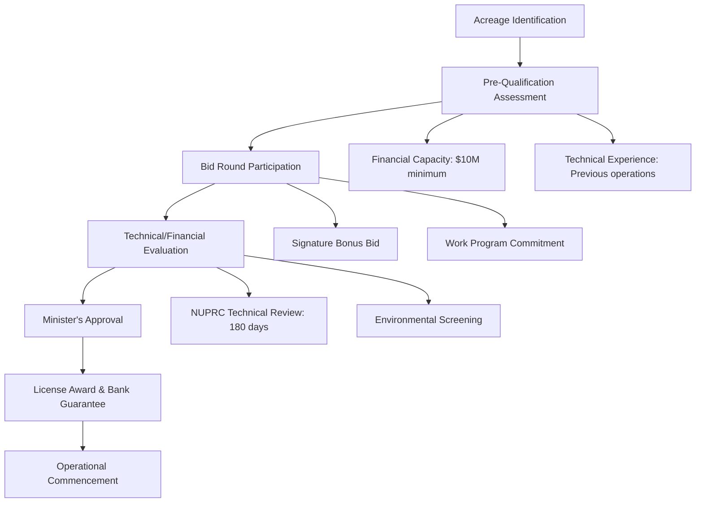

# Nigerian Petroleum Industry Act (PIA) 2021: Comprehensive UX Manuals and Tools Specification

## Executive Summary

This specification outlines comprehensive UX manuals and tools for the Nigerian Petroleum Industry Act (PIA) 2021, designed to enhance accessibility, usability, and implementation effectiveness across all stakeholder groups. Based on detailed analysis of the PIA's 319 sections across 4 chapters, comprehensive stakeholder mapping, international benchmarking against Norway, Brazil, and other successful models, and thorough UX usability assessment, this framework provides actionable specifications for six core deliverables.

**Key Components:**
- **PIA Navigation Guide**: Searchable digital interface with AI-powered functionality
- **Stakeholder-Specific Guides**: Tailored materials for 5 primary stakeholder categories
- **Automated Compliance Checklists**: Digital verification systems for regulatory compliance
- **Interactive Q&A Module**: AI-powered natural language query system
- **Stakeholder Dashboard**: Real-time obligations tracking and monitoring system
- **International Best Practices Integration**: Lessons from Norway, Brazil, and global leaders

**Strategic Foundation**: The framework incorporates Norway's transparent regulatory model (78% tax rate with sovereign wealth fund management), Brazil's ANP regulatory architecture with comprehensive oversight mechanisms, and successful National Oil Company transition models from Equinor's partial privatization approach.

## 1. Introduction

The Nigerian Petroleum Industry Act 2021 represents a comprehensive transformation of Africa's largest petroleum sector, establishing new regulatory institutions (NUPRC and NMDPRA), implementing innovative fiscal frameworks including the 30% Frontier Exploration Fund allocation, and creating unprecedented host community development mechanisms through mandatory trust structures funded by 3% of annual operating expenditures.

However, the complexity of this 11,717-line document with 319 sections creates significant usability challenges across five primary stakeholder categories: Government/Regulators, Oil and Gas Companies, Host Communities, Civil Society/Public, and International Partners. This specification addresses these challenges through evidence-based UX design principles, international best practices integration, and stakeholder-centered development approaches.

### 1.1 Research Foundation

This specification builds upon comprehensive research analysis including:
- **Document Analysis**: Complete semantic parsing of PIA 2021's structural and content architecture
- **Stakeholder Mapping**: Detailed analysis of roles, responsibilities, and interaction mechanisms
- **International Benchmarking**: Comparative analysis of Norway, Brazil, and Saudi Arabia's petroleum governance models
- **UX Usability Assessment**: Systematic evaluation of accessibility, navigation, and user experience challenges
- **Visual Design Framework**: Comprehensive specifications for interactive and visual delivery systems

### 1.2 Design Principles

**Accessibility First**: Multi-language support with plain language alternatives for community users
**Stakeholder-Centered**: Tailored interfaces and content for specific user needs and expertise levels
**International Standards**: Alignment with EITI transparency requirements and global best practices
**Digital Transformation**: Modern web-based tools with mobile optimization and offline capabilities
**Continuous Improvement**: Built-in feedback mechanisms and iterative enhancement protocols

## 2. Component 1: PIA Navigation Guide with Searchable Functionality

### 2.1 Overview and Objectives

The PIA Navigation Guide provides an intelligent, searchable digital interface that transforms the complex 319-section regulatory framework into an accessible, user-friendly navigation system. The guide addresses critical usability challenges identified in the UX analysis, including cross-reference complexity, document length barriers, and stakeholder-specific information needs.

### 2.2 Core Architecture Specifications

#### 2.2.1 Information Architecture

**Hierarchical Structure Design**:
```
Chapter Level (4 primary chapters)
├── Governance and Institutions (Sections 1-66)
├── Administration (Sections 67-234)
├── Host Communities Development (Sections 235-257)
└── Fiscal Framework (Sections 258-319)

Part Level (Subdivisions within chapters)
├── Technical Regulatory Functions
├── Commercial Oversight Powers
├── Community Rights and Obligations
└── Enforcement Mechanisms

Section Level (319 individual provisions)
├── Cross-Reference Mapping
├── Stakeholder Impact Analysis
├── Compliance Requirements
└── Implementation Guidelines
```

**Cross-Reference Integration System**:
- **Smart Linking**: Automated detection and linking of all 319 sections with related provisions
- **Relationship Mapping**: Visual network diagrams showing connections between sections
- **Contextual Previews**: Hover-over summaries of referenced sections
- **Breadcrumb Navigation**: Clear path tracking through complex cross-references

#### 2.2.2 Search Functionality Specifications

**Multi-Modal Search Architecture**:

**1. Full-Text Search Engine**:
```javascript
// Search Engine Specifications
{
  "searchTypes": {
    "fullText": {
      "indexing": "ElasticSearch with stemming and synonyms",
      "languages": ["English", "Hausa", "Yoruba", "Igbo"],
      "features": ["autocomplete", "spellCheck", "synonymMapping"]
    },
    "semantic": {
      "nlpEngine": "Advanced NLP with petroleum domain knowledge",
      "queryTypes": ["natural language", "intent recognition"],
      "responseFormat": "ranked results with confidence scores"
    },
    "structured": {
      "fieldSearch": ["section number", "stakeholder", "topic", "chapter"],
      "filterOptions": ["compliance type", "deadline", "authority"]
    }
  }
}
```

**2. AI-Powered Semantic Search**:
- **Natural Language Processing**: Understanding queries like "What are community rights in petroleum operations?"
- **Intent Recognition**: Identifying user goals (compliance, information, process guidance)
- **Contextual Ranking**: Results prioritized by user type and relevance
- **Related Suggestions**: Proactive identification of related sections and requirements

**3. Visual Search Interface**:
- **Interactive Diagrams**: Click-through navigation via organizational charts and process flows
- **Tag-Based Filtering**: Visual tag system for topics, stakeholders, and compliance areas
- **Geographic Search**: Location-based filtering for territorial jurisdictions

#### 2.2.3 User Interface Design Specifications

**Responsive Design Framework**:
```css
/* Primary Layout Specifications */
.pia-navigation-interface {
  /* Desktop: 1920x1080+ */
  display: grid;
  grid-template-columns: 300px 1fr 250px;
  grid-template-rows: 80px 1fr 60px;
  
  /* Tablet: 768-1199px */
  @media (max-width: 1199px) {
    grid-template-columns: 250px 1fr;
  }
  
  /* Mobile: <768px */
  @media (max-width: 767px) {
    grid-template-columns: 1fr;
    grid-template-rows: 60px 1fr 50px;
  }
}
```

**Navigation Panel Structure**:
- **Header**: Search bar with advanced options toggle
- **Left Sidebar**: Hierarchical tree navigation with current location highlighting
- **Main Content Area**: Selected section content with cross-reference integration
- **Right Sidebar**: Related sections, stakeholder information, and quick actions
- **Footer**: Language selection, accessibility options, and help documentation

### 2.3 Advanced Features and Functionality

#### 2.3.1 Personalization System

**User Profile Management**:
```json
{
  "userProfile": {
    "stakeholderType": "oil_company|government|community|civil_society|international",
    "jurisdiction": "upstream|midstream|downstream|all",
    "experienceLevel": "expert|intermediate|beginner",
    "language": "en|ha|yo|ig",
    "bookmarks": ["section_ids"],
    "searchHistory": ["query_terms"],
    "customDashboard": ["frequently_accessed_sections"]
  }
}
```

**Adaptive Interface**:
- **Smart Recommendations**: Sections relevant to user's profile and activity
- **Customizable Dashboard**: Personalized starting page with relevant sections
- **Progress Tracking**: Visual indicators for compliance requirements and deadlines
- **Notification System**: Alerts for regulatory updates affecting user's interests

#### 2.3.2 Multilingual Support Framework

**Language Implementation Strategy**:

**Tier 1 Languages (Complete Translation)**:
- **English**: Official language, full technical content
- **Hausa**: Northern Nigeria, petroleum exploration areas
- **Yoruba**: Southwest Nigeria, coastal operations
- **Igbo**: Southeast Nigeria, emerging petroleum activities

**Translation Quality Standards**:
```
Technical Content: Professional legal translation with petroleum industry expertise
Community Content: Plain language adaptation with cultural sensitivity
Legal Precision: Certified translation maintaining legal accuracy
User Interface: Native language UX copy with cultural appropriateness
```

**Implementation Technology**:
- **Content Management**: Multi-language CMS with version control
- **Translation Memory**: Consistent terminology across all content
- **Localization Engine**: Cultural adaptation beyond literal translation
- **Quality Assurance**: Native speaker review and legal validation

### 2.4 Technical Implementation Specifications

#### 2.4.1 Frontend Architecture

**Technology Stack**:
```javascript
// Primary Framework
React 18+ with TypeScript for type safety
Next.js for server-side rendering and SEO optimization
Material-UI with custom PIA theme
React Query for data fetching and caching

// Search and Navigation
ElasticSearch for full-text indexing
Fuse.js for client-side fuzzy search
D3.js for interactive visualizations
React Router for dynamic navigation

// Accessibility and Performance
ARIA compliance for screen readers
Lazy loading for large content sections
Service workers for offline functionality
Progressive Web App (PWA) capabilities
```

**Performance Requirements**:
- **Page Load Time**: <3 seconds on 3G connections
- **Search Response**: <500ms for basic queries, <2s for complex searches
- **Mobile Optimization**: 95+ Google PageSpeed Insights score
- **Accessibility**: WCAG 2.1 AA compliance minimum

#### 2.4.2 Backend Infrastructure

**API Design Specifications**:
```yaml
# RESTful API Endpoints
/api/v1/sections:
  GET: Retrieve PIA sections with filtering
  POST: Advanced search with complex queries
  
/api/v1/search:
  GET: Simple text search
  POST: Natural language and semantic search
  
/api/v1/cross-references/{sectionId}:
  GET: Related sections and dependencies
  
/api/v1/user/profile:
  GET/PUT: User preferences and customization
  
/api/v1/user/bookmarks:
  GET/POST/DELETE: Personal bookmarks management
```

**Database Schema**:
```sql
-- Core content structure
CREATE TABLE pia_sections (
    id SERIAL PRIMARY KEY,
    section_number VARCHAR(10) NOT NULL,
    chapter_id INTEGER REFERENCES pia_chapters(id),
    title_en TEXT NOT NULL,
    title_ha TEXT,
    title_yo TEXT,
    title_ig TEXT,
    content_en TEXT NOT NULL,
    content_ha TEXT,
    content_yo TEXT,
    content_ig TEXT,
    plain_language_summary TEXT,
    stakeholder_relevance JSONB,
    cross_references INTEGER[],
    compliance_deadlines JSONB,
    created_at TIMESTAMP DEFAULT NOW(),
    updated_at TIMESTAMP DEFAULT NOW()
);

-- Search optimization
CREATE INDEX idx_content_search ON pia_sections 
    USING GIN(to_tsvector('english', content_en));
CREATE INDEX idx_stakeholder_filter ON pia_sections 
    USING GIN(stakeholder_relevance);
```

## 3. Component 2: Stakeholder-Specific Section Guides and FAQs

### 3.1 Government/Regulatory Stakeholder Guide

#### 3.1.1 User Profile and Content Strategy

**Primary Users**: NUPRC staff, NMDPRA personnel, Ministry of Petroleum officials, NNPC Limited management

**Content Approach**: Professional, comprehensive coverage with technical depth and cross-agency coordination focus

**Key Sections Coverage**:

**Institutional Framework (Sections 4-66)**:
- NUPRC establishment and powers (Sections 4-28)
- NMDPRA authority and responsibilities (Sections 29-52)
- NNPC Limited transformation and commercial mandate (Sections 53-66)
- Inter-agency coordination mechanisms

**Regulatory Powers and Enforcement (Sections 68-234)**:
- Licensing authority and processes
- Compliance monitoring and enforcement
- Revenue collection mechanisms
- Technical oversight responsibilities

#### 3.1.2 Regulatory Authority Quick Reference Guide

**NUPRC Jurisdiction Summary**:
```markdown
## Upstream Regulatory Functions
- **Licensing**: Petroleum prospecting licenses (6-10 years) and mining leases (20 years)
- **Technical Oversight**: Field development plans, environmental compliance, safety standards
- **Fiscal Administration**: Royalty calculation, signature bonus collection, profit share oversight
- **Frontier Development**: 30% profit oil allocation management for exploration fund

## Key Compliance Areas
1. **Work Commitments**: Minimum exploration wells and geological surveys
2. **Environmental Standards**: EIA approval, gas flaring elimination, decommissioning plans
3. **Nigerian Content**: Local content plan compliance and monitoring
4. **Host Community**: Trust establishment verification and fund disbursement oversight
```

**NMDPRA Jurisdiction Summary**:
```markdown
## Midstream/Downstream Authority
- **Processing Facilities**: Gas processing, refining, petrochemical operations
- **Transportation**: Pipeline licensing, tariff regulation, third-party access
- **Market Regulation**: Pricing oversight, competition monitoring, supply security
- **Quality Control**: Product specifications, measurement standards, export certification

## Regulatory Priorities
1. **Market Competition**: Prevention of dominant position abuse
2. **Infrastructure Development**: Network expansion and accessibility
3. **Consumer Protection**: Fair pricing and service quality standards
4. **Strategic Reserves**: Petroleum product stock management
```

#### 3.1.3 Frequently Asked Questions for Regulators

**Q1: How do NUPRC and NMDPRA coordinate on integrated operations?**
```
A: Section 216-234 establish common provisions requiring:
- Joint licensing for integrated upstream-midstream projects
- Shared data repositories and information systems
- Coordinated enforcement actions for violations
- Regular inter-agency consultation meetings
- Unified reporting requirements for companies with multiple licenses
```

**Q2: What are the enforcement powers and penalty structures?**
```
A: Both agencies have comprehensive enforcement authority:
- Minimum fines of ₦5,000,000 for non-compliance
- Daily penalties of ₦100,000 for continuing violations
- License suspension/revocation powers
- Facility sealing authority for safety violations
- Special Investigation Units with arrest powers
```

**Q3: How is the 30% Frontier Exploration Fund managed and allocated?**
```
A: NNPC Limited transfers 30% of profit oil and gas to the fund (Sections 57-58):
- NUPRC administers fund allocation for frontier basin exploration
- Transparent bidding processes for exploration acreage
- Performance-based funding linked to exploration commitments
- Annual reporting to Minister and National Assembly
```

### 3.2 Oil and Gas Companies Guide

#### 3.2.1 User Profile and Content Strategy

**Primary Users**: License holders, legal and compliance teams, community relations specialists, financial officers

**Content Approach**: Process-oriented guidance with clear compliance pathways and cost implications

#### 3.2.2 Licensing Process Navigation Guide

**Petroleum Prospecting License Pathway**:


**Key Requirements Checklist**:
```markdown
## Pre-Application Requirements
- [ ] Financial capacity demonstration ($10M minimum for PPL)
- [ ] Technical competence evidence (previous operations)
- [ ] Bank guarantee for work commitments
- [ ] Environmental and social baseline studies
- [ ] Community consultation records

## Application Documentation
- [ ] Detailed work program with geological/geophysical activities
- [ ] Investment commitments and timeline
- [ ] Nigerian content plan (minimum 70% for goods, 80% for services)
- [ ] Host community development framework
- [ ] Health, safety, and environmental management plan
```

#### 3.2.3 Compliance Requirements Matrix

**Ongoing Obligations by License Type**:

| Obligation Category | PPL Requirements | PML Requirements | Timeline |
|-------------------|------------------|------------------|----------|
| **Work Commitments** | Minimum 1 exploration well per period | Field development plan implementation | Annual review |
| **Financial Reporting** | Quarterly expenditure reports | Monthly production and revenue reporting | Ongoing |
| **Host Community** | Trust establishment within 12 months | 3% annual operating expenditure contribution | Annual |
| **Environmental** | Baseline studies and monitoring | EIA compliance and gas flaring elimination | Continuous |
| **Nigerian Content** | Plan submission and progress reporting | Quarterly compliance verification | Quarterly |

#### 3.2.4 Fiscal Framework Guide for Companies

**Hydrocarbon Tax Structure**:
```markdown
## Tax Rates and Calculation
- **Rate**: 30% (onshore/shallow water under specific conditions) or 15% (other operations)
- **Tax Base**: Chargeable income after allowable deductions
- **Payment**: Estimated payments with final assessment

## Allowable Deductions
✓ Rents and royalties paid to government
✓ Plant and machinery repair expenses
✓ First exploration and first two appraisal wells per field
✓ Decommissioning and abandonment fund contributions
✓ Host community development trust contributions
✓ Gas reinjection well costs

## Non-Allowable Deductions
✗ Production and signature bonuses
✗ Capital improvements and expansion costs
✗ Financial charges and litigation expenses
✗ Head office and affiliate management costs
✗ Penalty payments and gas flare fees
```

#### 3.2.5 Frequently Asked Questions for Oil Companies

**Q1: What are the specific requirements for host community trust establishment?**
```
A: Section 235-239 require:
- Incorporation within 12 months of operations commencement
- Board of Trustees appointment with regulatory approval
- 3% of annual operating expenditure funding commitment
- Governance structure with community representation
- Annual audit and reporting to regulatory authorities
```

**Q2: How are work commitments evaluated and what are consequences of non-performance?**
```
A: Work commitment evaluation includes:
- Technical program delivery against approved plans
- Financial expenditure verification through audited accounts
- Timeline compliance with approved schedules
- Non-performance may result in license forfeiture or relinquishment
- Cure periods available for technical delays with regulatory approval
```

**Q3: What are the procedures for license transfers and farm-out arrangements?**
```
A: License transfers require (Section 73-78):
- Prior written approval from Minister upon NUPRC recommendation
- Financial and technical capacity demonstration by transferee
- Outstanding obligation settlement by transferor
- Host community consultation and consent
- Applicable fees and administrative charges payment
```

### 3.3 Host Communities Guide

#### 3.3.1 User Profile and Content Strategy

**Primary Users**: Community members, traditional authorities, local government representatives, community development committees

**Content Approach**: Plain language summaries with visual aids, multilingual support, and culturally appropriate communication

#### 3.3.2 Community Rights and Benefits Overview

**Plain Language Summary of Key Rights**:

**Your Community's Rights Under the PIA**:
```markdown
## What You Are Entitled To

### 1. Development Funding (Section 240)
- Every petroleum company operating in your area MUST contribute 3% of their annual expenses to community development
- This money goes into a special fund called the "Host Communities Development Trust"
- The fund is managed by a board that includes people from your community

### 2. Participation in Decision-Making (Sections 242-250)
- Your community gets to choose representatives for the trust board
- You participate in deciding which development projects to fund
- You help monitor how the money is being used

### 3. Environmental Protection (Sections 102-103)
- Companies must protect your environment and clean up any damage
- You have the right to report environmental problems
- Companies must pay for environmental restoration

### 4. Information and Transparency (Section 254-255)
- You have the right to know how much money is in your community fund
- You can access annual reports about development projects
- All financial records must be audited and made available to you
```

#### 3.3.3 Host Community Development Trust Guide

**Understanding Your Trust Structure**:
```markdown
## Who Manages Your Community Fund?

### Board of Trustees (Section 242)
- **Who They Are**: Respected people from your community chosen by the oil company in consultation with you
- **What They Do**: Make major decisions about fund allocation and project approval
- **Your Role**: Help choose these people and hold them accountable

### Management Committee (Section 247)
- **Who They Are**: Representatives from each community plus professional managers
- **What They Do**: Plan budgets, manage day-to-day operations, supervise projects
- **Your Role**: Each community selects its representative

### Advisory Committee (Section 249)
- **Who They Are**: At least one person from each affected community
- **What They Do**: Suggest projects, monitor progress, report community concerns
- **Your Role**: Participate in meetings and represent your community's needs
```

#### 3.3.4 Development Fund Allocation Guide

**How Your Community Money is Used**:
```markdown
## Fund Allocation (Section 245)

### Capital Fund (75% of total money)
- **Purpose**: Build lasting projects for your community
- **Examples**: 
  - Schools and education facilities
  - Health centers and clinics
  - Roads and bridges
  - Water supply systems
  - Electricity projects

### Reserve Fund (20% of total money)
- **Purpose**: Save money for future needs and emergencies
- **Management**: Invested safely to grow over time
- **Access**: Can be used for major community emergencies

### Administrative Fund (5% of total money)
- **Purpose**: Pay for trust operations and management
- **Includes**: Office expenses, staff salaries, meeting costs
- **Limit**: Cannot exceed 5% of total annual contribution
```

#### 3.3.5 Community Participation Process Guide

**How to Participate in Your Community Development**:

**Step 1: Needs Assessment (Section 251)**
```markdown
## Community Needs Assessment
- Oil companies must ask your community what you need most
- Everyone in the community should participate
- List your priorities: education, health, roads, water, etc.
- Your input directly affects what projects get funded
```

**Step 2: Development Planning (Section 252)**
```markdown
## Creating Your Development Plan
- Your needs assessment becomes a formal development plan
- The plan shows what projects will be funded and when
- You can review and comment on the plan before approval
- The plan must be updated regularly based on changing needs
```

**Step 3: Project Implementation and Monitoring**
```markdown
## Watching Your Projects
- You have the right to monitor all development projects
- Attend project site visits and progress meetings
- Report any problems with project quality or delays
- Participate in project completion evaluations
```

#### 3.3.6 Grievance and Dispute Resolution for Communities

**What to Do If You Have Problems**:

**Level 1: Community Discussion**
```markdown
## Talk Within Your Community First
- Discuss issues at community meetings
- Try to resolve problems through traditional authorities
- Document your concerns and attempts to resolve them
- Involve community advisory committee representatives
```

**Level 2: Formal Grievance Process**
```markdown
## File a Formal Complaint
- Submit written complaints to the trust management
- Request formal investigation of your concerns
- Ask for written responses with timelines for resolution
- Escalate to regulatory authorities if no satisfactory response
```

**Level 3: Regulatory Intervention**
```markdown
## Contact Government Regulators
- Report unresolved issues to NUPRC or NMDPRA
- Request regulatory investigation and enforcement
- Participate in regulatory mediation processes
- Access legal support for serious violations
```

#### 3.3.7 Frequently Asked Questions for Host Communities

**Q1: How much money should our community receive each year?**
```
A: Your community receives 3% of the oil company's annual operating expenses, allocated as:
- 75% for development projects (schools, roads, health centers)
- 20% saved for future needs
- 5% for administrative costs
The exact amount depends on the company's annual spending in your area.
```

**Q2: Can we choose what development projects to fund?**
```
A: Yes! The process includes:
- Community needs assessment where you identify priorities
- Participation in project selection through your representatives
- Approval process involving community consultation
- Right to monitor and evaluate project implementation
```

**Q3: What happens if the oil company doesn't pay into our community fund?**
```
A: Non-payment is a serious violation with consequences:
- Report to NUPRC or NMDPRA immediately
- Regulatory agencies can impose fines starting at ₦5,000,000
- Companies can lose their operating licenses
- Legal action can be taken to recover unpaid funds
```

### 3.4 Civil Society and Public Stakeholder Guide

#### 3.4.1 User Profile and Content Strategy

**Primary Users**: NGOs, academic researchers, journalists, advocacy groups, general public

**Content Approach**: Transparency-focused content with data access guidance and accountability mechanisms

#### 3.4.2 Transparency and Access to Information Guide

**What Information is Publicly Available**:
```markdown
## Public Registers (Maintained by NUPRC/NMDPRA)

### License Information
- Current petroleum licenses and their holders
- License terms and conditions
- Work commitments and performance status
- Transfer and assignment records

### Financial Information
- Signature bonus payments
- Royalty and tax payment records
- Production data and reserve estimates
- Revenue allocation and distribution

### Beneficial Ownership
- Ultimate beneficial owners of license holders
- Corporate structure and shareholding information
- Changes in ownership and control
- Related party transactions
```

#### 3.4.3 Monitoring and Accountability Tools

**How to Monitor Government and Industry Performance**:

**1. License Award Monitoring**
```markdown
## Tracking Licensing Transparency
- Monitor bid round announcements and criteria
- Verify competitive and transparent award processes
- Check compliance with EITI standards
- Report any irregularities to appropriate authorities
```

**2. Revenue Transparency Tracking**
```markdown
## Following the Money
- Access revenue payment data through public registers
- Cross-reference with government budget documents
- Monitor revenue allocation to host communities
- Verify compliance with fiscal transparency standards
```

**3. Environmental and Social Impact Monitoring**
```markdown
## Community and Environmental Oversight
- Access environmental impact assessments
- Monitor compliance with environmental standards
- Track host community development fund utilization
- Report environmental violations to regulatory authorities
```

#### 3.4.4 Research and Analysis Resources

**Data Access and Analysis Tools**:
```markdown
## Available Datasets
- Production statistics (monthly/quarterly/annual)
- Reserve estimates and field development status
- License holder financial performance
- Revenue collection and allocation data
- Environmental compliance and violation records

## Analysis Methods
- Comparative analysis with international benchmarks
- Trend analysis of sector performance
- Impact assessment of policy changes
- Stakeholder engagement effectiveness evaluation
```

#### 3.4.5 Advocacy and Engagement Mechanisms

**How to Influence Policy and Implementation**:
```markdown
## Formal Participation Channels
- Public consultation processes for policy development
- Regulatory authority stakeholder engagement forums
- Parliamentary oversight and committee participation
- International monitoring body reporting (EITI, etc.)

## Civil Society Coordination
- Coalition building with other advocacy organizations
- Joint monitoring and research initiatives
- Shared platforms for information dissemination
- Coordinated policy advocacy and reform campaigns
```

### 3.5 International Partners Guide

#### 3.5.1 User Profile and Content Strategy

**Primary Users**: Foreign petroleum companies, international financial institutions, multilateral organizations, peer regulatory bodies

**Content Approach**: Professional standards alignment with international benchmarking and investment climate assessment

#### 3.5.2 Investment Climate and Regulatory Framework Assessment

**Key Investment Considerations**:
```markdown
## Regulatory Stability and Predictability
- New institutional framework with clear mandates
- Separation of commercial (NNPC Limited) and regulatory functions
- Professional governance with board structures
- Appeal mechanisms and dispute resolution procedures

## Fiscal Terms Competitiveness
- Hydrocarbon tax rates: 15-30% depending on location and lease type
- Competitive royalty structures with production-based scaling
- Clear deduction policies for operational and development costs
- Transparent revenue collection and allocation mechanisms
```

#### 3.5.3 International Standards Compliance Assessment

**Comparison with Global Best Practices**:

| Standard/Framework | Nigeria PIA 2021 | Norway Model | Brazil ANP | Assessment |
|-------------------|------------------|--------------|------------|------------|
| **Regulatory Independence** | Separate authorities with professional boards | Ministry oversight with NOD independence | ANP technical autonomy | Good alignment |
| **Transparency Requirements** | Public registers and beneficial ownership | Full EITI Plus compliance | Comprehensive disclosure | Strong framework |
| **Community Engagement** | Mandatory trust structures with funding | Local content and environmental standards | Social responsibility requirements | Leading practice |
| **Fiscal Competitiveness** | 15-30% hydrocarbon tax | 78% total tax rate | Variable royalty and tax | Competitive terms |
| **Environmental Standards** | EIA requirements and gas flaring elimination | Strict environmental regulation | Comprehensive environmental oversight | International standards |

#### 3.5.4 Due Diligence and Risk Assessment Framework

**Investment Decision Support Tools**:
```markdown
## Regulatory Risk Assessment
- Institutional capacity and effectiveness evaluation
- Policy consistency and implementation track record
- Political stability and governance quality indicators
- International arbitration and dispute resolution access

## Operational Risk Evaluation
- License security and transfer mechanisms
- Community relations and social acceptance factors
- Environmental compliance requirements and costs
- Local content obligations and capacity availability
```

## 4. Component 3: Automated Compliance Checklists

### 4.1 Host Community Fund Allocation Compliance System

#### 4.1.1 Digital Verification Framework

**Automated Compliance Architecture**:
```javascript
// Host Community Compliance Checker
class HostCommunityComplianceChecker {
  constructor(companyId, operatingArea) {
    this.companyId = companyId;
    this.operatingArea = operatingArea;
    this.complianceStatus = {};
  }

  async checkTrustEstablishment() {
    const requirements = {
      incorporationTimeline: {
        existing: 12, // months for existing operations
        new: "before field development plan approval"
      },
      boardComposition: {
        minimumMembers: 5,
        communityRepresentation: "required",
        professionalStandards: "high integrity individuals"
      },
      regulatoryApproval: {
        authority: "NUPRC for upstream, NMDPRA for midstream/downstream",
        documentationRequired: ["incorporation papers", "board appointments", "governance structure"]
      }
    };
    
    return await this.verifyCompliance("trust_establishment", requirements);
  }

  async checkFundingCalculation() {
    const fundingRequirements = {
      contributionRate: 0.03, // 3% of annual operating expenditure
      calculationBasis: "actual annual operating expenditure from preceding financial year",
      allocationStructure: {
        capitalFund: 0.75,
        reserveFund: 0.20,
        administrativeFund: 0.05
      },
      paymentSchedule: "annual with quarterly reviews"
    };
    
    return await this.verifyCompliance("funding_calculation", fundingRequirements);
  }
}
```

#### 4.1.2 Step-by-Step Verification Process

**Phase 1: Trust Establishment Verification**
```markdown
## Trust Establishment Checklist

### 1. Timeline Compliance
- [ ] For existing operations: Trust incorporated within 12 months (Section 236)
- [ ] For new operations: Trust established before field development plan approval
- [ ] Documentation: Certificate of incorporation with registration date

### 2. Governance Structure
- [ ] Board of Trustees appointed (minimum 5 members)
- [ ] Community consultation documented for board appointments
- [ ] Regulatory approval obtained from NUPRC/NMDPRA
- [ ] Board terms limited to 4 years with one renewal option (Section 242)

### 3. Legal Compliance
- [ ] Trust incorporated under applicable Nigerian law
- [ ] Trust deed compliant with PIA requirements
- [ ] Objectives aligned with Section 239 purposes
- [ ] Management committee established per Section 247
```

**Phase 2: Financial Compliance Verification**
```markdown
## Funding and Financial Management Checklist

### 1. Contribution Calculation
- [ ] 3% rate applied to actual annual operating expenditure
- [ ] Calculation based on audited financial statements
- [ ] Excludes capital expenditure and one-time costs
- [ ] Documentation: Annual calculation worksheet with audit trail

### 2. Fund Allocation Verification
- [ ] 75% allocated to capital fund for development projects
- [ ] 20% allocated to reserve fund for long-term sustainability
- [ ] 5% allocated to administrative fund for operational costs
- [ ] Documentation: Annual allocation statement with breakdown

### 3. Payment and Transfer
- [ ] Funds transferred to trust account within required timeline
- [ ] Payment documentation maintained
- [ ] Bank confirmation of receipt by trust
- [ ] Regulatory notification completed
```

**Phase 3: Project Implementation Verification**
```markdown
## Development Project Compliance Checklist

### 1. Needs Assessment Compliance (Section 251)
- [ ] Community needs assessment conducted
- [ ] All host communities consulted
- [ ] Assessment methodology documented
- [ ] Results incorporated into development plan

### 2. Project Selection and Approval
- [ ] Development plan created per Section 252
- [ ] Community input documented in project selection
- [ ] Board of Trustees approval obtained
- [ ] Regulatory authority notification completed

### 3. Implementation Monitoring
- [ ] Project implementation timeline established
- [ ] Progress monitoring system in place
- [ ] Community feedback mechanism operational
- [ ] Quarterly progress reports prepared
```

#### 4.1.3 Automated Risk Assessment System

**Compliance Risk Matrix**:
```python
class ComplianceRiskAssessment:
    def __init__(self):
        self.risk_categories = {
            "timeline_risk": {
                "high": "Trust not established within required timeframe",
                "medium": "Delays in board appointment or approval",
                "low": "Minor administrative delays"
            },
            "financial_risk": {
                "high": "Underpayment or non-payment of contributions",
                "medium": "Calculation errors or timing delays",
                "low": "Documentation or reporting issues"
            },
            "governance_risk": {
                "high": "Community disputes or board conflicts",
                "medium": "Representation or consultation gaps",
                "low": "Procedural compliance issues"
            }
        }
    
    def assess_compliance_risk(self, company_data):
        risk_score = 0
        risk_factors = []
        
        # Timeline assessment
        if company_data.get('trust_establishment_delay', 0) > 12:
            risk_score += 30
            risk_factors.append("Critical: Trust establishment deadline exceeded")
        
        # Financial assessment
        contribution_gap = company_data.get('funding_shortfall', 0)
        if contribution_gap > 0.1:  # >10% shortfall
            risk_score += 25
            risk_factors.append("High: Significant funding shortfall identified")
        
        # Governance assessment
        community_complaints = company_data.get('community_grievances', 0)
        if community_complaints > 5:
            risk_score += 20
            risk_factors.append("Medium: Multiple community grievances")
        
        return {
            "overall_risk": self.categorize_risk(risk_score),
            "risk_factors": risk_factors,
            "recommendations": self.generate_recommendations(risk_score)
        }
```

### 4.2 Environmental Standards Compliance System

#### 4.2.1 Environmental Compliance Framework

**Automated Environmental Monitoring**:
```javascript
class EnvironmentalComplianceMonitor {
  constructor(operatorId, licenseType) {
    this.operatorId = operatorId;
    this.licenseType = licenseType;
    this.complianceModules = {
      gasFlaring: new GasFlaringMonitor(),
      environmental: new EnvironmentalImpactMonitor(),
      decommissioning: new DecommissioningPlanMonitor()
    };
  }

  async checkGasFlaringCompliance() {
    const requirements = {
      eliminationDeadline: {
        routine: "Immediate - no routine flaring permitted",
        emergency: "Safety flaring only with immediate reporting"
      },
      penaltyStructure: {
        calculation: "Based on volume and environmental impact",
        collection: "NMDPRA for midstream, NUPRC for upstream"
      },
      reportingRequirements: {
        frequency: "Monthly reports required",
        format: "Standard regulatory template",
        submission: "Electronic submission mandatory"
      }
    };
    
    return await this.verifyCompliance("gas_flaring", requirements);
  }
}
```

#### 4.2.2 Environmental Impact Assessment Compliance

**EIA Compliance Verification Process**:
```markdown
## Environmental Impact Assessment Checklist

### 1. EIA Preparation and Approval (Section 102)
- [ ] EIA prepared by certified consultants
- [ ] Comprehensive environmental baseline established
- [ ] Community consultation documented
- [ ] Regulatory approval obtained before operations
- [ ] EIA updated for major project changes

### 2. Environmental Management Plan Implementation
- [ ] Environmental management system established
- [ ] Regular monitoring and reporting system operational
- [ ] Environmental incidents reporting protocol in place
- [ ] Corrective action procedures documented
- [ ] Annual environmental performance review completed

### 3. Decommissioning and Abandonment Planning
- [ ] Decommissioning plan submitted with field development plan
- [ ] Financial provision for decommissioning established
- [ ] Regular plan updates submitted to regulatory authority
- [ ] Community consultation on decommissioning plans
- [ ] Environmental restoration commitments documented
```

#### 4.2.3 Gas Flaring Elimination Compliance

**Gas Flaring Monitoring System**:
```markdown
## Gas Flaring Compliance Verification

### 1. Flaring Elimination Requirements
- [ ] Routine gas flaring eliminated immediately
- [ ] Safety flaring procedures documented and approved
- [ ] Gas utilization or re-injection systems operational
- [ ] Emergency flaring reporting system in place

### 2. Monitoring and Reporting
- [ ] Continuous flaring volume monitoring installed
- [ ] Monthly flaring reports submitted to authorities
- [ ] Flaring incidents documented with root cause analysis
- [ ] Corrective action plans implemented for violations

### 3. Penalty Compliance
- [ ] Flaring penalty calculations verified
- [ ] Penalty payments made within required timeframes
- [ ] Appeals process followed for disputed penalties
- [ ] Compliance improvement plans submitted
```

### 4.3 Integrated Compliance Dashboard

#### 4.3.1 Real-Time Compliance Monitoring

**Dashboard Architecture**:
```react
// Compliance Dashboard Component
import React, { useState, useEffect } from 'react';
import { ComplianceAPI } from '../services/complianceAPI';

const ComplianceDashboard = ({ companyId, stakeholderType }) => {
  const [complianceData, setComplianceData] = useState({});
  const [riskAlerts, setRiskAlerts] = useState([]);

  useEffect(() => {
    const fetchComplianceStatus = async () => {
      const data = await ComplianceAPI.getComplianceStatus(companyId);
      setComplianceData(data);
      
      const alerts = await ComplianceAPI.getRiskAlerts(companyId);
      setRiskAlerts(alerts);
    };

    fetchComplianceStatus();
    const interval = setInterval(fetchComplianceStatus, 300000); // 5 minutes
    return () => clearInterval(interval);
  }, [companyId]);

  return (
    <div className="compliance-dashboard">
      <ComplianceOverview data={complianceData} />
      <RiskAlertPanel alerts={riskAlerts} />
      <ComplianceMetrics companyId={companyId} />
      <ActionItems stakeholderType={stakeholderType} />
    </div>
  );
};
```

#### 4.3.2 Predictive Compliance Analytics

**Machine Learning-Based Risk Prediction**:
```python
import pandas as pd
from sklearn.ensemble import RandomForestClassifier
from sklearn.preprocessing import LabelEncoder

class ComplianceRiskPredictor:
    def __init__(self):
        self.model = RandomForestClassifier(n_estimators=100, random_state=42)
        self.label_encoder = LabelEncoder()
        
    def train_model(self, historical_data):
        """Train model on historical compliance data"""
        features = [
            'company_size', 'operation_type', 'location_risk',
            'previous_violations', 'management_quality',
            'community_relations_score', 'financial_stability'
        ]
        
        X = historical_data[features]
        y = self.label_encoder.fit_transform(historical_data['compliance_risk'])
        
        self.model.fit(X, y)
        
    def predict_risk(self, company_features):
        """Predict compliance risk for a company"""
        risk_probability = self.model.predict_proba([company_features])
        risk_level = self.label_encoder.inverse_transform(
            self.model.predict([company_features])
        )[0]
        
        return {
            'risk_level': risk_level,
            'probability': max(risk_probability[0]),
            'risk_factors': self.identify_risk_factors(company_features)
        }
```

## 5. Component 4: Interactive Q&A Module Specifications

### 5.1 AI-Powered Natural Language Processing Architecture

#### 5.1.1 Core NLP Framework

**Language Processing Pipeline**:
```python
import spacy
import transformers
from sentence_transformers import SentenceTransformer

class PIAQueryProcessor:
    def __init__(self):
        # Load specialized petroleum industry NLP model
        self.nlp = spacy.load("en_core_web_lg")
        
        # Petroleum domain-specific transformer model
        self.domain_model = SentenceTransformer('law-ai/InLegalBERT')
        
        # Query classification model
        self.intent_classifier = transformers.pipeline(
            "text-classification",
            model="microsoft/DialoGPT-medium",
            tokenizer="microsoft/DialoGPT-medium"
        )
        
        # PIA content embeddings for semantic search
        self.content_embeddings = self.load_pia_embeddings()
        
    def process_query(self, query_text, user_context=None):
        """Process natural language query about PIA"""
        
        # Step 1: Intent classification
        intent = self.classify_intent(query_text)
        
        # Step 2: Entity extraction
        entities = self.extract_entities(query_text)
        
        # Step 3: Semantic search for relevant content
        relevant_sections = self.find_relevant_sections(query_text)
        
        # Step 4: Generate contextual response
        response = self.generate_response(
            query_text, intent, entities, relevant_sections, user_context
        )
        
        return {
            'query': query_text,
            'intent': intent,
            'entities': entities,
            'relevant_sections': relevant_sections,
            'response': response,
            'confidence': response.get('confidence', 0.0)
        }
```

#### 5.1.2 Query Intent Classification

**Intent Categories and Examples**:
```json
{
  "intent_categories": {
    "licensing_inquiry": {
      "examples": [
        "How do I apply for a petroleum prospecting license?",
        "What are the requirements for mining lease approval?",
        "How long does the licensing process take?"
      ],
      "response_template": "licensing_process_guide"
    },
    "compliance_question": {
      "examples": [
        "What are my reporting obligations?",
        "How often do I need to submit compliance reports?",
        "What happens if I violate environmental standards?"
      ],
      "response_template": "compliance_requirements"
    },
    "host_community_inquiry": {
      "examples": [
        "How much should we contribute to community development?",
        "What rights do host communities have?",
        "How is the community fund managed?"
      ],
      "response_template": "community_provisions"
    },
    "fiscal_question": {
      "examples": [
        "What is the hydrocarbon tax rate?",
        "How are royalties calculated?",
        "What deductions are allowed for tax purposes?"
      ],
      "response_template": "fiscal_framework"
    },
    "regulatory_authority": {
      "examples": [
        "Which agency regulates upstream operations?",
        "What are NUPRC's powers?",
        "How do NUPRC and NMDPRA coordinate?"
      ],
      "response_template": "regulatory_structure"
    }
  }
}
```

#### 5.1.3 Contextual Response Generation

**Response Generation Framework**:
```python
class ResponseGenerator:
    def __init__(self, pia_content_db):
        self.content_db = pia_content_db
        self.response_templates = self.load_response_templates()
        
    def generate_response(self, query, intent, entities, sections, user_context):
        """Generate comprehensive response with PIA citations"""
        
        # Select appropriate response template
        template = self.response_templates[intent['category']]
        
        # Extract relevant content from identified sections
        content = self.extract_section_content(sections)
        
        # Generate base response
        base_response = self.apply_template(template, content, entities)
        
        # Add contextual information based on user type
        contextual_response = self.add_user_context(
            base_response, user_context
        )
        
        # Include authoritative citations
        response_with_citations = self.add_citations(
            contextual_response, sections
        )
        
        # Confidence scoring
        confidence = self.calculate_confidence(
            query, intent, sections, response_with_citations
        )
        
        return {
            'response': response_with_citations,
            'confidence': confidence,
            'sections_referenced': sections,
            'follow_up_suggestions': self.generate_follow_ups(intent, entities)
        }
```

### 5.2 Intelligent Query Understanding

#### 5.2.1 Domain-Specific Entity Recognition

**Petroleum Industry Entity Extraction**:
```python
class PIAEntityExtractor:
    def __init__(self):
        # Custom NER model trained on petroleum law text
        self.entity_patterns = {
            'license_types': [
                'petroleum prospecting license', 'PPL', 'petroleum mining lease', 'PML',
                'midstream license', 'downstream license', 'processing license'
            ],
            'regulatory_bodies': [
                'NUPRC', 'NMDPRA', 'NNPC Limited', 'Ministry of Petroleum',
                'Nigerian Upstream Regulatory Commission',
                'Nigerian Midstream and Downstream Petroleum Regulatory Authority'
            ],
            'fiscal_terms': [
                'hydrocarbon tax', 'royalty', 'signature bonus', 'profit oil',
                'profit gas', 'frontier exploration fund'
            ],
            'compliance_areas': [
                'environmental compliance', 'host community development',
                'gas flaring', 'Nigerian content', 'health and safety'
            ],
            'time_periods': [
                'annual', 'quarterly', 'monthly', 'within 12 months',
                '180 days', '6 years', '10 years', '20 years'
            ]
        }
        
    def extract_entities(self, text):
        """Extract domain-specific entities from query text"""
        entities = {}
        
        # Extract section references
        section_pattern = r'[Ss]ection\s+(\d+)'
        entities['sections'] = re.findall(section_pattern, text)
        
        # Extract entity types
        for entity_type, patterns in self.entity_patterns.items():
            entities[entity_type] = [
                pattern for pattern in patterns 
                if pattern.lower() in text.lower()
            ]
        
        return entities
```

#### 5.2.2 Multi-Language Query Support

**Multilingual Query Processing**:
```python
class MultilingualQueryProcessor:
    def __init__(self):
        self.supported_languages = {
            'en': 'English',
            'ha': 'Hausa', 
            'yo': 'Yoruba',
            'ig': 'Igbo'
        }
        
        # Translation models for each supported language
        self.translators = {
            'ha': self.load_hausa_translator(),
            'yo': self.load_yoruba_translator(),
            'ig': self.load_igbo_translator()
        }
        
    def process_multilingual_query(self, query, source_language):
        """Process query in local language and respond appropriately"""
        
        if source_language != 'en':
            # Translate query to English for processing
            english_query = self.translate_to_english(query, source_language)
            
            # Process in English
            english_response = self.process_english_query(english_query)
            
            # Translate response back to source language
            localized_response = self.translate_response(
                english_response, source_language
            )
            
            return {
                'original_query': query,
                'source_language': source_language,
                'english_translation': english_query,
                'response': localized_response,
                'response_language': source_language
            }
        else:
            return self.process_english_query(query)
```

### 5.3 Interactive Query Interface

#### 5.3.1 Conversational Interface Design

**Chat Interface Component**:
```react
import React, { useState, useRef, useEffect } from 'react';
import { PIAQueryAPI } from '../services/queryAPI';

const PIAQueryInterface = ({ userProfile }) => {
  const [messages, setMessages] = useState([]);
  const [inputValue, setInputValue] = useState('');
  const [isTyping, setIsTyping] = useState(false);
  const [language, setLanguage] = useState(userProfile.language || 'en');
  const messagesEndRef = useRef(null);

  const scrollToBottom = () => {
    messagesEndRef.current?.scrollIntoView({ behavior: "smooth" });
  };

  useEffect(scrollToBottom, [messages]);

  const handleSendMessage = async () => {
    if (!inputValue.trim()) return;

    // Add user message
    const userMessage = {
      id: Date.now(),
      type: 'user',
      content: inputValue,
      timestamp: new Date()
    };
    
    setMessages(prev => [...prev, userMessage]);
    setInputValue('');
    setIsTyping(true);

    try {
      // Query the PIA AI system
      const response = await PIAQueryAPI.processQuery({
        query: inputValue,
        language: language,
        userContext: userProfile
      });

      // Add AI response
      const aiMessage = {
        id: Date.now() + 1,
        type: 'ai',
        content: response.response,
        citations: response.sections_referenced,
        confidence: response.confidence,
        followUps: response.follow_up_suggestions,
        timestamp: new Date()
      };

      setMessages(prev => [...prev, aiMessage]);
    } catch (error) {
      const errorMessage = {
        id: Date.now() + 1,
        type: 'error',
        content: 'I apologize, but I encountered an error processing your query. Please try rephrasing your question.',
        timestamp: new Date()
      };
      setMessages(prev => [...prev, errorMessage]);
    } finally {
      setIsTyping(false);
    }
  };

  return (
    <div className="pia-query-interface">
      <div className="chat-header">
        <h3>PIA 2021 Assistant</h3>
        <LanguageSelector 
          value={language} 
          onChange={setLanguage}
          options={['en', 'ha', 'yo', 'ig']}
        />
      </div>
      
      <div className="chat-messages">
        {messages.map(message => (
          <ChatMessage 
            key={message.id} 
            message={message} 
            userProfile={userProfile}
          />
        ))}
        {isTyping && <TypingIndicator />}
        <div ref={messagesEndRef} />
      </div>
      
      <div className="chat-input">
        <QuerySuggestions userProfile={userProfile} onSelect={setInputValue} />
        <div className="input-group">
          <input
            type="text"
            value={inputValue}
            onChange={(e) => setInputValue(e.target.value)}
            onKeyPress={(e) => e.key === 'Enter' && handleSendMessage()}
            placeholder="Ask about PIA 2021 provisions..."
            className="message-input"
          />
          <button 
            onClick={handleSendMessage}
            disabled={!inputValue.trim() || isTyping}
            className="send-button"
          >
            Send
          </button>
        </div>
      </div>
    </div>
  );
};
```

#### 5.3.2 Guided Query Assistance

**Smart Query Suggestions**:
```react
const QuerySuggestions = ({ userProfile, onSelect }) => {
  const getSuggestions = () => {
    const commonQueries = {
      'oil_company': [
        'How do I apply for a petroleum prospecting license?',
        'What are my host community obligations?',
        'How is the hydrocarbon tax calculated?',
        'What environmental standards must I meet?'
      ],
      'government': [
        'What are NUPRC\'s enforcement powers?',
        'How do NUPRC and NMDPRA coordinate?',
        'What revenue collection mechanisms exist?',
        'How is the frontier exploration fund managed?'
      ],
      'community': [
        'What are our rights under the PIA?',
        'How much funding should our community receive?',
        'How do we participate in trust governance?',
        'What happens if companies don\'t pay?'
      ],
      'civil_society': [
        'What information is publicly available?',
        'How can we monitor license awards?',
        'What transparency requirements exist?',
        'How do we report violations?'
      ]
    };

    return commonQueries[userProfile.stakeholderType] || commonQueries['oil_company'];
  };

  return (
    <div className="query-suggestions">
      <p>Common questions:</p>
      <div className="suggestion-buttons">
        {getSuggestions().map((suggestion, index) => (
          <button
            key={index}
            onClick={() => onSelect(suggestion)}
            className="suggestion-button"
          >
            {suggestion}
          </button>
        ))}
      </div>
    </div>
  );
};
```

### 5.4 Advanced Query Features

#### 5.4.1 Legal Citation and Cross-Reference System

**Automatic Citation Generation**:
```python
class PIACitationGenerator:
    def __init__(self, pia_content):
        self.pia_content = pia_content
        
    def generate_citations(self, referenced_sections):
        """Generate properly formatted legal citations"""
        citations = []
        
        for section_id in referenced_sections:
            section = self.pia_content.get_section(section_id)
            
            citation = {
                'section_number': section.number,
                'title': section.title,
                'chapter': section.chapter,
                'full_citation': f"Section {section.number} of the Petroleum Industry Act 2021",
                'url': f"/pia/section/{section.number}",
                'confidence': section.relevance_score
            }
            
            citations.append(citation)
        
        return sorted(citations, key=lambda x: x['confidence'], reverse=True)
        
    def format_response_with_citations(self, response_text, citations):
        """Embed citations in response text"""
        formatted_response = response_text
        
        for i, citation in enumerate(citations, 1):
            # Add inline citation markers
            formatted_response += f"\n\n[{i}] {citation['full_citation']}"
            
        return formatted_response
```

#### 5.4.2 Comparative Analysis Queries

**Benchmarking Query Handler**:
```python
class ComparativeQueryProcessor:
    def __init__(self, international_data):
        self.international_data = international_data
        
    def process_comparative_query(self, query, entities):
        """Handle queries comparing Nigeria's framework with other countries"""
        
        if 'norway' in query.lower():
            return self.compare_with_norway(entities)
        elif 'brazil' in query.lower():
            return self.compare_with_brazil(entities)
        elif 'international best practices' in query.lower():
            return self.compare_with_best_practices(entities)
        else:
            return self.general_comparative_analysis(entities)
            
    def compare_with_norway(self, entities):
        """Compare specific aspects with Norway's model"""
        comparison = {
            'fiscal_terms': {
                'nigeria': '15-30% hydrocarbon tax rate',
                'norway': '78% total tax rate with sophisticated depletion allowances',
                'analysis': 'Nigeria offers more competitive tax rates but Norway demonstrates higher revenue capture through comprehensive fiscal design'
            },
            'transparency': {
                'nigeria': 'Public registers and beneficial ownership disclosure',
                'norway': 'Full EITI Plus compliance with extensive voluntary disclosure',
                'analysis': 'Both countries meet international transparency standards, with Norway providing additional voluntary disclosures'
            },
            'local_content': {
                'nigeria': '70% goods, 80% services minimum requirements',
                'norway': 'Market-driven approach with strong domestic capabilities',
                'analysis': 'Nigeria uses mandatory percentages while Norway achieved local content through market development'
            }
        }
        
        return self.format_comparison_response(comparison, 'Norway')
```

## 6. Component 5: Stakeholder Dashboard Mockup Specifications

### 6.1 Government/Regulatory Dashboard

#### 6.1.1 Executive Overview Dashboard

**Dashboard Architecture for Regulatory Authorities**:
```react
const RegulatoryDashboard = ({ authority, userRole }) => {
  const [dashboardData, setDashboardData] = useState({});
  const [timeframe, setTimeframe] = useState('monthly');
  
  return (
    <div className="regulatory-dashboard">
      <DashboardHeader authority={authority} timeframe={timeframe} />
      
      <div className="dashboard-grid">
        <MetricsOverview 
          licenses={dashboardData.licenses}
          revenue={dashboardData.revenue}
          compliance={dashboardData.compliance}
        />
        
        <LicenseManagementPanel 
          pendingApplications={dashboardData.pending}
          activeSupervision={dashboardData.active}
          complianceAlerts={dashboardData.alerts}
        />
        
        <RevenueTrackingWidget 
          collections={dashboardData.collections}
          allocations={dashboardData.allocations}
          projections={dashboardData.projections}
        />
        
        <ComplianceMonitoringPanel 
          violations={dashboardData.violations}
          investigations={dashboardData.investigations}
          enforcement={dashboardData.enforcement}
        />
      </div>
      
      <DetailedAnalytics authority={authority} userRole={userRole} />
    </div>
  );
};
```

**Key Performance Indicators (KPIs)**:
```markdown
## NUPRC Dashboard KPIs

### Licensing Performance
- Applications processed within 180-day target: 85%
- Revenue collected vs. projected: 112%
- Active licenses under supervision: 47
- Compliance rate for environmental standards: 78%

### Enforcement Metrics
- Violations detected and addressed: 23 (current quarter)
- Average resolution time for violations: 45 days
- Penalties collected: ₦2.3 billion (current year)
- License revocations: 0 (maintaining industry stability)

### Revenue Collection
- Signature bonuses collected: ₦15.7 billion
- Royalties collected: ₦245.8 billion
- Production sharing receipts: ₦67.2 billion
- Frontier exploration fund transfers: ₦89.4 billion
```

#### 6.1.2 Real-Time Monitoring Interface

**Live Operations Dashboard**:
```javascript
// Real-time monitoring component
const LiveMonitoringDashboard = () => {
  const [liveData, setLiveData] = useState({});
  const [alerts, setAlerts] = useState([]);

  useEffect(() => {
    // WebSocket connection for real-time updates
    const ws = new WebSocket('wss://pia-monitoring.gov.ng/live');
    
    ws.onmessage = (event) => {
      const update = JSON.parse(event.data);
      
      switch(update.type) {
        case 'production_update':
          updateProductionData(update.data);
          break;
        case 'compliance_alert':
          addComplianceAlert(update.data);
          break;
        case 'revenue_payment':
          updateRevenueData(update.data);
          break;
        default:
          console.log('Unknown update type:', update.type);
      }
    };

    return () => ws.close();
  }, []);

  return (
    <div className="live-monitoring">
      <AlertsPanel alerts={alerts} />
      <ProductionMonitoring data={liveData.production} />
      <RevenueFlowTracking data={liveData.revenue} />
      <ComplianceStatusGrid data={liveData.compliance} />
    </div>
  );
};
```

### 6.2 Oil and Gas Company Dashboard

#### 6.2.1 Compliance Management Dashboard

**Company Operations Dashboard**:
```react
const CompanyDashboard = ({ companyId, licensePortfolio }) => {
  return (
    <div className="company-dashboard">
      <ComplianceOverview companyId={companyId} />
      
      <div className="dashboard-sections">
        <LicensePortfolioPanel 
          licenses={licensePortfolio}
          renewalAlerts={getUpcomingRenewals(licensePortfolio)}
        />
        
        <HostCommunityTracker 
          trusts={getActiveTrusts(companyId)}
          fundingStatus={getFundingStatus(companyId)}
          projectProgress={getProjectProgress(companyId)}
        />
        
        <EnvironmentalCompliance 
          eiaCertificates={getEIAStatus(companyId)}
          gasFlaringStatus={getGasFlaringData(companyId)}
          environmentalReporting={getEnvironmentalReports(companyId)}
        />
        
        <FiscalObligations 
          taxStatus={getTaxStatus(companyId)}
          royaltyPayments={getRoyaltyStatus(companyId)}
          upcomingPayments={getPaymentSchedule(companyId)}
        />
      </div>
      
      <ReportingCenter companyId={companyId} />
    </div>
  );
};
```

**Compliance Status Matrix**:
```markdown
## License Compliance Dashboard

### PPL-001-2024 (Niger Delta Block 15)
**Status**: ✅ Compliant
- Work Commitment: 2/2 wells completed (100%)
- Environmental Compliance: EIA approved, monitoring current
- Host Community: Trust established, ₦4.2B contributed (current year)
- Financial: All payments current, next royalty due March 15

### PML-045-2019 (Bonga Field Development)
**Status**: ⚠️ Attention Required
- Production: 89% of approved capacity
- Gas Flaring: 5% above target, improvement plan submitted
- Host Community: Quarterly report due in 7 days
- Environmental: Annual audit scheduled for next month

### Processing License MP-012-2023
**Status**: ❌ Non-Compliant
- Safety Standards: 3 violations identified in last inspection
- Corrective Action: 30-day cure period active
- Regulatory Meeting: Scheduled for next week
- Support: Legal and technical teams engaged
```

#### 6.2.2 Automated Reporting System

**Report Generation and Submission**:
```python
class AutomatedReportingSystem:
    def __init__(self, company_id):
        self.company_id = company_id
        self.report_templates = self.load_templates()
        
    def generate_monthly_compliance_report(self):
        """Generate automated monthly compliance report"""
        
        report_data = {
            'reporting_period': self.get_current_month(),
            'license_portfolio': self.get_license_data(),
            'production_data': self.get_production_metrics(),
            'environmental_data': self.get_environmental_metrics(),
            'host_community_data': self.get_community_metrics(),
            'fiscal_data': self.get_fiscal_metrics()
        }
        
        # Generate PDF report
        report_pdf = self.generate_pdf_report(report_data)
        
        # Submit to regulatory authorities
        submission_results = self.submit_to_authorities(report_pdf)
        
        # Update compliance dashboard
        self.update_dashboard_status(submission_results)
        
        return {
            'report_generated': True,
            'submission_status': submission_results,
            'next_due_date': self.calculate_next_due_date()
        }
```

### 6.3 Host Community Dashboard

#### 6.3.1 Community Development Tracking

**Community Dashboard Interface**:
```react
const CommunityDashboard = ({ communityId, trustId }) => {
  const [fundData, setFundData] = useState({});
  const [projects, setProjects] = useState([]);
  const [governance, setGovernance] = useState({});

  return (
    <div className="community-dashboard">
      <CommunityHeader communityId={communityId} />
      
      <div className="dashboard-grid">
        <FundOverview 
          totalFunds={fundData.total}
          allocation={fundData.allocation}
          yearToDate={fundData.ytd}
        />
        
        <ProjectTracker 
          activeProjects={projects.active}
          completedProjects={projects.completed}
          plannedProjects={projects.planned}
        />
        
        <GovernancePanel 
          boardMembers={governance.board}
          upcomingMeetings={governance.meetings}
          recentDecisions={governance.decisions}
        />
        
        <TransparencyCenter 
          financialReports={getFinancialReports(trustId)}
          auditReports={getAuditReports(trustId)}
          communityUpdates={getCommunityUpdates(trustId)}
        />
      </div>
      
      <CommunityEngagement communityId={communityId} />
    </div>
  );
};
```

**Fund Allocation Visualization**:
```javascript
// Fund allocation chart component
const FundAllocationChart = ({ allocationData }) => {
  const chartConfig = {
    type: 'doughnut',
    data: {
      labels: ['Capital Projects (75%)', 'Reserve Fund (20%)', 'Administration (5%)'],
      datasets: [{
        data: [
          allocationData.capital,
          allocationData.reserve,
          allocationData.administrative
        ],
        backgroundColor: ['#2E7D32', '#1976D2', '#F57C00']
      }]
    },
    options: {
      responsive: true,
      plugins: {
        legend: { position: 'bottom' },
        title: { 
          display: true, 
          text: 'Community Development Fund Allocation' 
        }
      }
    }
  };

  return (
    <div className="fund-allocation-chart">
      <Doughnut data={chartConfig.data} options={chartConfig.options} />
      <div className="allocation-details">
        <div>Capital Projects: ₦{allocationData.capital.toLocaleString()}</div>
        <div>Reserve Fund: ₦{allocationData.reserve.toLocaleString()}</div>
        <div>Administration: ₦{allocationData.administrative.toLocaleString()}</div>
      </div>
    </div>
  );
};
```

#### 6.3.2 Project Monitoring Interface

**Community Project Dashboard**:
```markdown
## Active Development Projects

### Primary Healthcare Center Construction
- **Budget**: ₦45 million (from capital fund)
- **Progress**: 65% complete
- **Timeline**: Expected completion March 2025
- **Status**: On schedule, minor equipment delays
- **Community Impact**: Serving 3,500 residents

### Secondary School Renovation
- **Budget**: ₦28 million
- **Progress**: 90% complete
- **Timeline**: Completion expected January 2025
- **Status**: Ahead of schedule
- **Community Impact**: 800 students benefiting

### Water Supply Infrastructure
- **Budget**: ₦67 million
- **Progress**: 45% complete (Phase 1 of 3)
- **Timeline**: Full completion December 2025
- **Status**: On track, environmental clearances obtained
- **Community Impact**: Clean water for 5,000 residents
```

### 6.4 Integrated Multi-Stakeholder View

#### 6.4.1 Cross-Stakeholder Analytics

**Ecosystem Performance Dashboard**:
```react
const EcosystemDashboard = ({ userRole, permissions }) => {
  return (
    <div className="ecosystem-dashboard">
      <PerformanceOverview />
      
      <div className="stakeholder-views">
        {permissions.includes('regulatory_view') && (
          <RegulatoryPerformancePanel />
        )}
        
        {permissions.includes('industry_view') && (
          <IndustryPerformancePanel />
        )}
        
        {permissions.includes('community_view') && (
          <CommunityDevelopmentPanel />
        )}
        
        {permissions.includes('public_view') && (
          <TransparencyMetricsPanel />
        )}
      </div>
      
      <IntegratedAnalytics userRole={userRole} />
    </div>
  );
};
```

**System-Wide KPIs**:
```markdown
## PIA Implementation Performance Metrics

### Regulatory Effectiveness
- License processing efficiency: 87% within target timeframes
- Compliance monitoring coverage: 95% of active operations
- Revenue collection rate: 102% of projections
- Enforcement response time: Average 12 days

### Industry Performance  
- Investment attraction: $4.2B in new commitments (current year)
- Operational compliance rate: 82% overall
- Community fund contributions: 98% payment compliance
- Environmental standard adherence: 76% full compliance

### Community Development Impact
- Active community trusts: 47 (covering 156 communities)
- Total development funding: ₦34.7 billion (current year)
- Project completion rate: 73% on time and budget
- Community satisfaction score: 68% (improving trend)

### Transparency and Accountability
- Public data availability: 94% of required disclosures current
- EITI compliance score: 89% (improving towards full compliance)
- Grievance resolution rate: 78% within target timeframes
- Stakeholder engagement participation: 65% average attendance
```

## 7. Component 6: International Best Practices Integration

### 7.1 Norway Model Integration

#### 7.1.1 Norwegian Governance Framework Adaptation

**Governance Principles Implementation**:
```markdown
## Norway's 10 State Ownership Principles - PIA Application

### 1. Equal Treatment of Shareholders
**Norway**: Government as controlling shareholder treats minority shareholders fairly
**PIA Application**: NNPC Limited governance structure should ensure minority partner protection
**Implementation**: Board independence requirements, transparent decision-making processes

### 2. Transparency of Ownership
**Norway**: Clear government ownership policies and objectives
**PIA Application**: Clear government strategic objectives for NNPC Limited
**Implementation**: Published ownership strategy, performance targets, governance guidelines

### 3. Decision-Making Through General Meetings
**Norway**: Major decisions made through formal shareholder meetings
**PIA Application**: NNPC Limited strategic decisions through proper corporate governance
**Implementation**: Annual general meetings, special resolutions for major decisions

### 4. Performance Target Setting
**Norway**: Clear financial and strategic performance targets
**PIA Application**: NNPC Limited KPIs aligned with national development objectives
**Implementation**: Annual performance agreements, transparent reporting
```

#### 7.1.2 Norwegian Transparency Standards

**EITI Plus Implementation Framework**:
```python
class EITIComplianceFramework:
    def __init__(self):
        self.disclosure_requirements = {
            'payments_to_government': {
                'frequency': 'annual',
                'detail_level': 'by_payment_type_and_receiving_entity',
                'verification': 'independent_audit_required'
            },
            'production_data': {
                'frequency': 'monthly',
                'detail_level': 'by_field_and_product_type',
                'verification': 'regulatory_authority_validation'
            },
            'beneficial_ownership': {
                'frequency': 'annual_or_upon_change',
                'detail_level': 'ultimate_beneficial_owners_above_threshold',
                'threshold': '10% ownership',
                'verification': 'legal_attestation_required'
            },
            'contract_terms': {
                'requirement': 'full_disclosure_of_new_contracts',
                'exemptions': 'commercially_sensitive_information_redacted',
                'timeline': 'within_90_days_of_signature'
            }
        }
        
    def generate_eiti_report(self, company_data, reporting_year):
        """Generate comprehensive EITI-compliant transparency report"""
        
        report = {
            'reporting_entity': company_data['name'],
            'reporting_year': reporting_year,
            'payments_to_government': self.compile_payment_data(company_data),
            'production_volumes': self.compile_production_data(company_data),
            'beneficial_ownership': self.compile_ownership_data(company_data),
            'licenses_and_contracts': self.compile_contract_data(company_data),
            'social_expenditures': self.compile_social_data(company_data)
        }
        
        return report
```

#### 7.1.3 Norwegian Local Content Success Model

**Capacity Building Framework**:
```markdown
## Norway's Local Content Strategy - Nigeria Adaptation

### Phase 1: Foundation Building (Years 1-3)
**Norway Approach**: Built on existing maritime and engineering capabilities
**Nigeria Application**: Leverage existing oil services infrastructure and technical institutes
**Specific Actions**:
- Map existing capabilities in Nigerian oil services sector
- Identify gaps in technical competencies and equipment
- Establish partnerships between Nigerian and international companies
- Create technical training programs in existing institutions

### Phase 2: Capability Development (Years 3-7)
**Norway Approach**: Mandatory training and technology transfer requirements
**Nigeria Application**: Enhanced training obligations and skills development
**Specific Actions**:
- Require 80% Nigerian staff in operational roles within 5 years
- Mandate technology transfer agreements for major projects
- Establish Centers of Excellence in petroleum engineering
- Create apprenticeship programs with international operators

### Phase 3: Competitive Development (Years 7-15)
**Norway Approach**: Transition from protection to competition
**Nigeria Application**: Gradual reduction of protection with performance standards
**Specific Actions**:
- Implement competitive bidding with Nigerian content criteria
- Support Nigerian company participation in international markets
- Establish indigenous company development fund
- Create performance-based local content requirements
```

### 7.2 Brazil ANP Model Integration

#### 7.2.1 Regulatory Institution Strengthening

**ANP Regulatory Framework Adaptation**:
```markdown
## Brazil ANP Success Factors - NUPRC/NMDPRA Application

### Technical Capacity Building
**Brazil ANP**: 800+ technical staff, 50% with specialized petroleum expertise
**Nigeria Target**: Build NUPRC/NMDPRA to 500+ technical staff by 2027
**Implementation Strategy**:
- Recruit experienced international petroleum professionals
- Establish training partnerships with ANP and other international agencies
- Create rotation programs with leading regulatory authorities
- Develop specialized certification programs for regulatory staff

### Information Management Systems
**Brazil ANP**: Comprehensive digital platforms for all regulatory functions
**Nigeria Implementation**: Integrated digital platform for NUPRC/NMDPRA
**Technical Specifications**:
- Real-time production data monitoring
- Automated compliance verification systems
- Public transparency portals with searchable databases
- Mobile applications for field inspections and data collection

### Enforcement Capabilities
**Brazil ANP**: Comprehensive enforcement powers with effective penalty structures
**Nigeria Enhancement**: Strengthen NUPRC/NMDPRA enforcement mechanisms
**Specific Improvements**:
- Enhanced investigation capabilities with specialized units
- Graduated penalty structures with clear escalation procedures
- Alternative dispute resolution mechanisms
- International arbitration capabilities for complex cases
```

#### 7.2.2 Integrated Regulatory Oversight

**Multi-Agency Coordination Framework**:
```python
class IntegratedRegulatorySystem:
    def __init__(self):
        self.agencies = {
            'nuprc': {
                'primary_functions': ['upstream_licensing', 'production_oversight', 'revenue_collection'],
                'coordination_areas': ['integrated_projects', 'environmental_oversight', 'community_development']
            },
            'nmdpra': {
                'primary_functions': ['midstream_licensing', 'downstream_regulation', 'market_oversight'],
                'coordination_areas': ['integrated_projects', 'infrastructure_development', 'consumer_protection']
            },
            'federal_ministry': {
                'primary_functions': ['policy_development', 'strategic_oversight', 'international_relations'],
                'coordination_areas': ['all_petroleum_sector_activities']
            }
        }
        
    def coordinate_licensing_decision(self, application_data):
        """Coordinate multi-agency licensing decisions"""
        
        coordination_result = {
            'primary_authority': self.determine_primary_authority(application_data),
            'consultation_required': self.identify_consultation_requirements(application_data),
            'decision_timeline': self.calculate_coordination_timeline(application_data),
            'escalation_procedure': self.define_escalation_process(application_data)
        }
        
        return coordination_result
        
    def monitor_integrated_compliance(self, operator_id):
        """Monitor compliance across multiple regulatory jurisdictions"""
        
        compliance_status = {
            'upstream_compliance': self.check_nuprc_compliance(operator_id),
            'midstream_compliance': self.check_nmdpra_compliance(operator_id),
            'integrated_issues': self.identify_cross_jurisdictional_issues(operator_id),
            'coordination_actions': self.recommend_coordination_actions(operator_id)
        }
        
        return compliance_status
```

### 7.3 Global Best Practices Integration

#### 7.3.1 Multi-Country Comparative Framework

**Best Practice Integration Matrix**:
```markdown
## International Best Practice Integration

| Practice Area | Norway Model | Brazil Model | Australia Model | Nigeria PIA Integration |
|---------------|--------------|--------------|-----------------|------------------------|
| **Transparency** | EITI Plus voluntary disclosure | Comprehensive public reporting | Full contract transparency | Public registers + beneficial ownership |
| **Local Content** | Market-driven capability building | Mandatory percentage requirements | Skills-based development | Hybrid approach with performance targets |
| **Revenue Management** | Sovereign wealth fund (Government Pension Fund) | Direct budget integration | Future Fund for long-term savings | Frontier Exploration Fund + development funds |
| **Community Engagement** | Environmental and traditional rights focus | Social compensation mechanisms | Native title and consultation requirements | Mandatory development trusts with governance |
| **Environmental Standards** | Strict offshore environmental regulation | Environmental licensing integration | Marine park and biodiversity protection | EIA requirements + gas flaring elimination |
```

#### 7.3.2 Adaptive Implementation Strategy

**Phased Best Practice Implementation**:
```markdown
## Implementation Roadmap for International Best Practices

### Phase 1: Foundation (2024-2026)
**Priority**: Establish basic compliance with international standards
**Key Actions**:
- Complete NUPRC/NMDPRA institutional setup
- Implement basic EITI compliance requirements
- Establish host community trust operational frameworks
- Begin regulatory capacity building programs

### Phase 2: Enhancement (2026-2028)
**Priority**: Upgrade to leading practice standards
**Key Actions**:
- Achieve EITI Plus voluntary disclosure standards
- Implement advanced local content development programs
- Establish sovereign wealth fund for petroleum revenues
- Create integrated digital regulatory platforms

### Phase 3: Excellence (2028-2030)
**Priority**: Achieve global leadership in petroleum governance
**Key Actions**:
- Become regional model for petroleum sector governance
- Lead African petroleum sector transparency initiatives
- Establish Nigeria as hub for petroleum sector training and expertise
- Achieve top quartile performance in global petroleum governance rankings
```

## 8. Technical Implementation Guidelines

### 8.1 System Architecture Overview

#### 8.1.1 Cloud Infrastructure Design

**Architecture Specifications**:
```yaml
# Cloud Infrastructure Design for PIA UX System
Infrastructure:
  Cloud_Provider: "Microsoft Azure (Nigeria region preferred)"
  Architecture_Pattern: "Microservices with API Gateway"
  
Compute_Resources:
  API_Gateway: "Azure API Management"
  Application_Services: "Azure App Service (Standard tier)"
  Background_Processing: "Azure Functions (Consumption plan)"
  Container_Orchestration: "Azure Kubernetes Service (AKS)"

Data_Storage:
  Primary_Database: "Azure PostgreSQL (General Purpose tier)"
  Document_Storage: "Azure Cosmos DB for JSON documents"
  File_Storage: "Azure Blob Storage for documents/media"
  Search_Engine: "Azure Cognitive Search"
  Cache_Layer: "Azure Redis Cache"

Security:
  Identity_Management: "Azure Active Directory B2C"
  API_Security: "OAuth 2.0 with JWT tokens"
  Data_Encryption: "TLS 1.3 in transit, AES-256 at rest"
  Network_Security: "Virtual Network with NSG rules"

Monitoring:
  Application_Monitoring: "Azure Application Insights"
  Infrastructure_Monitoring: "Azure Monitor"
  Log_Analytics: "Azure Log Analytics workspace"
  Alert_Management: "Azure Action Groups"
```

#### 8.1.2 Data Integration Framework

**Data Sources and Integration Points**:
```python
class PIADataIntegrationFramework:
    def __init__(self):
        self.data_sources = {
            'pia_content': {
                'source': 'Legal document database',
                'format': 'Structured XML/JSON',
                'update_frequency': 'On regulatory changes',
                'integration_method': 'ETL pipeline'
            },
            'regulatory_data': {
                'source': 'NUPRC/NMDPRA operational systems',
                'format': 'REST APIs',
                'update_frequency': 'Real-time',
                'integration_method': 'API integration'
            },
            'company_data': {
                'source': 'Corporate filings and submissions',
                'format': 'PDF, Excel, structured forms',
                'update_frequency': 'Monthly/Quarterly',
                'integration_method': 'Document processing pipeline'
            },
            'community_data': {
                'source': 'Host community trust systems',
                'format': 'Financial reports, project data',
                'update_frequency': 'Quarterly',
                'integration_method': 'Secure data exchange'
            }
        }
        
    def establish_data_pipeline(self, source_name):
        """Establish data integration pipeline for specific source"""
        
        source_config = self.data_sources[source_name]
        
        pipeline = {
            'extraction': self.configure_extraction(source_config),
            'transformation': self.configure_transformation(source_config),
            'loading': self.configure_loading(source_config),
            'quality_checks': self.configure_quality_validation(source_config),
            'monitoring': self.configure_pipeline_monitoring(source_config)
        }
        
        return pipeline
```

### 8.2 Security and Privacy Framework

#### 8.2.1 Data Protection and Privacy

**GDPR and Nigerian Data Protection Compliance**:
```markdown
## Data Protection Framework

### Personal Data Classification
**Tier 1 - Highly Sensitive**:
- Individual beneficial ownership information
- Community member personal details
- Government official contact information
**Protection**: End-to-end encryption, access logging, data minimization

**Tier 2 - Sensitive**:
- Company financial information
- Compliance reports and assessments
- Internal regulatory communications
**Protection**: Role-based access control, audit trails, retention policies

**Tier 3 - Public Information**:
- License awards and terms
- Public consultation documents
- Published regulatory guidelines
**Protection**: Data integrity controls, version management

### Privacy by Design Principles
1. **Data Minimization**: Collect only necessary information for regulatory purposes
2. **Purpose Limitation**: Use data only for specified legitimate purposes
3. **Storage Limitation**: Implement automated data retention and deletion policies
4. **Accuracy**: Maintain data quality and correction mechanisms
5. **Security**: Implement appropriate technical and organizational measures
6. **Accountability**: Document compliance measures and privacy impact assessments
```

#### 8.2.2 Access Control and Authentication

**Multi-Factor Authentication Framework**:
```javascript
// Authentication and authorization system
class PIAAuthenticationSystem {
  constructor() {
    this.authProviders = {
      'government': new GovernmentSSO(),
      'companies': new CorporateAuth(),
      'communities': new CommunityAuth(),
      'public': new PublicAuth()
    };
    
    this.roleBasedAccess = {
      'regulator_admin': ['full_system_access'],
      'regulator_staff': ['read_write_regulatory_data'],
      'company_admin': ['company_data_management'],
      'company_user': ['read_company_data', 'submit_reports'],
      'community_leader': ['community_trust_management'],
      'community_member': ['read_community_data'],
      'public_user': ['read_public_data'],
      'civil_society': ['read_transparency_data']
    };
  }

  async authenticateUser(credentials, userType) {
    // Multi-factor authentication flow
    const primaryAuth = await this.authProviders[userType].authenticate(credentials);
    
    if (primaryAuth.success && primaryAuth.requiresMFA) {
      const mfaToken = await this.sendMFAChallenge(primaryAuth.userId);
      const mfaVerification = await this.verifyMFAToken(mfaToken);
      return mfaVerification;
    }
    
    return primaryAuth;
  }

  authorizeAccess(userId, requestedResource, action) {
    const userRole = this.getUserRole(userId);
    const requiredPermissions = this.getResourcePermissions(requestedResource, action);
    const userPermissions = this.roleBasedAccess[userRole];
    
    return requiredPermissions.every(permission => 
      userPermissions.includes(permission)
    );
  }
}
```

### 8.3 Performance and Scalability

#### 8.3.1 Performance Requirements

**System Performance Specifications**:
```markdown
## Performance Requirements

### Response Time Targets
- **Search Queries**: <500ms for simple searches, <2s for complex semantic searches
- **Dashboard Loading**: <3s for initial load, <1s for subsequent navigation
- **Document Retrieval**: <2s for PIA sections, <5s for complex documents
- **Real-time Updates**: <100ms for live compliance monitoring data

### Scalability Requirements
- **Concurrent Users**: Support 10,000 simultaneous users
- **Peak Load**: Handle 100,000 page views per hour during high-activity periods
- **Data Growth**: Accommodate 10TB+ of regulatory and compliance data
- **Geographic Distribution**: Sub-200ms response times across Nigeria

### Availability Requirements
- **Uptime**: 99.9% availability (maximum 8.76 hours downtime per year)
- **Disaster Recovery**: Recovery Time Objective (RTO) of 4 hours
- **Data Backup**: Recovery Point Objective (RPO) of 1 hour
- **Maintenance Windows**: Scheduled maintenance outside business hours
```

#### 8.3.2 Optimization Strategies

**Performance Optimization Framework**:
```python
class PerformanceOptimizationFramework:
    def __init__(self):
        self.optimization_strategies = {
            'caching': {
                'levels': ['browser', 'CDN', 'application', 'database'],
                'policies': {
                    'static_content': '24 hours',
                    'pia_sections': '1 hour (updates rare)',
                    'search_results': '15 minutes',
                    'user_sessions': '30 minutes'
                }
            },
            'database_optimization': {
                'indexing': 'Full-text search indexes on all searchable content',
                'partitioning': 'Partition large tables by date/stakeholder type',
                'read_replicas': 'Read replicas for reporting and analytics',
                'connection_pooling': 'Connection pooling for efficient resource usage'
            },
            'content_delivery': {
                'cdn': 'Azure CDN for static assets and cached content',
                'compression': 'Gzip compression for all text-based responses',
                'image_optimization': 'WebP format with fallbacks for browser compatibility',
                'lazy_loading': 'Progressive loading for large documents and dashboards'
            }
        }
        
    def implement_performance_monitoring(self):
        """Implement comprehensive performance monitoring"""
        
        monitoring_config = {
            'real_user_monitoring': {
                'metrics': ['page_load_time', 'user_interactions', 'error_rates'],
                'sampling': '100% for performance, 10% for detailed traces'
            },
            'synthetic_monitoring': {
                'tests': ['critical_user_journeys', 'api_endpoints', 'search_functionality'],
                'frequency': 'Every 5 minutes from multiple locations'
            },
            'infrastructure_monitoring': {
                'metrics': ['cpu_usage', 'memory_usage', 'disk_io', 'network_latency'],
                'alerting': 'Alert on 80% resource utilization or performance degradation'
            }
        }
        
        return monitoring_config
```

## 9. User Training Materials Framework

### 9.1 Training Program Structure

#### 9.1.1 Stakeholder-Specific Training Modules

**Comprehensive Training Framework**:
```markdown
## Training Program Architecture

### Government/Regulatory Training (40 hours)
**Module 1: PIA Overview and Implementation (8 hours)**
- Legislative background and objectives
- Institutional framework and role definitions
- International best practices integration
- Implementation timeline and priorities

**Module 2: Regulatory Authority Operations (12 hours)**
- NUPRC upstream regulatory functions
- NMDPRA midstream/downstream oversight
- Inter-agency coordination mechanisms
- Enforcement procedures and penalty frameworks

**Module 3: Digital Systems Training (8 hours)**
- Regulatory dashboard navigation
- Compliance monitoring systems
- Real-time data analysis tools
- Reporting and documentation systems

**Module 4: Stakeholder Engagement (8 hours)**
- Community consultation best practices
- Industry liaison and coordination
- Public transparency requirements
- International reporting obligations

**Module 5: Advanced Topics (4 hours)**
- Complex regulatory scenarios
- Dispute resolution procedures
- Emergency response protocols
- Continuous improvement processes
```

#### 9.1.2 Oil and Gas Company Training

**Industry Training Program (32 hours)**:
```markdown
## Company Training Modules

### Module 1: Compliance Fundamentals (8 hours)
**Learning Objectives**:
- Understand all PIA compliance requirements
- Navigate licensing processes effectively
- Implement appropriate governance structures
- Establish compliant reporting systems

**Training Methods**:
- Interactive workshops with case studies
- Hands-on navigation of digital systems
- Role-playing exercises for complex scenarios
- Assessment through practical compliance tasks

### Module 2: Host Community Engagement (8 hours)
**Key Topics**:
- Community consultation best practices
- Trust establishment and governance
- Development fund management
- Conflict resolution and grievance handling

**Practical Exercises**:
- Mock community consultation sessions
- Trust governance structure design
- Development project planning workshops
- Grievance resolution simulations

### Module 3: Environmental and Technical Compliance (8 hours)
**Coverage Areas**:
- Environmental impact assessment processes
- Gas flaring elimination requirements
- Safety standard implementation
- Decommissioning planning

### Module 4: Digital Tools and Reporting (8 hours)
**System Training**:
- Company dashboard navigation
- Automated compliance reporting
- Real-time monitoring systems
- Document management platforms
```

#### 9.1.3 Host Community Training

**Community Empowerment Program (24 hours)**:
```markdown
## Community Training Framework

### Module 1: Understanding Your Rights (6 hours)
**Content Delivery**: Plain language with visual aids and local language support
**Key Topics**:
- Community rights under PIA 2021
- Development fund entitlements
- Participation opportunities
- Grievance mechanisms

**Training Methods**:
- Community assemblies with traditional authorities
- Peer-to-peer education programs
- Visual storytelling and infographics
- Question-and-answer sessions

### Module 2: Trust Governance Participation (6 hours)
**Practical Skills**:
- Board of Trustees selection and oversight
- Management committee participation
- Project monitoring and evaluation
- Financial accountability understanding

### Module 3: Development Planning (6 hours)
**Capacity Building**:
- Needs assessment participation
- Project prioritization methods
- Implementation monitoring
- Impact evaluation

### Module 4: Digital Literacy and Access (6 hours)
**Technology Training**:
- Community dashboard navigation
- Mobile application usage
- Online information access
- Digital communication tools
```

### 9.2 Training Delivery Methods

#### 9.2.1 Multi-Modal Training Approach

**Training Delivery Specifications**:
```markdown
## Training Delivery Methods

### In-Person Training
**Format**: Face-to-face workshops and seminars
**Best For**: Complex regulatory topics, hands-on system training, group problem-solving
**Duration**: 1-3 day intensive programs
**Locations**: Major cities and regional centers
**Capacity**: 20-30 participants per session

### Virtual Training
**Format**: Live online sessions with interaction
**Best For**: Routine updates, refresher training, wide geographic reach
**Technology**: Video conferencing with screen sharing and breakout rooms
**Duration**: 2-4 hour sessions
**Accessibility**: Multilingual support and recorded sessions

### Blended Learning
**Format**: Combination of online modules and in-person workshops
**Best For**: Comprehensive certification programs
**Structure**: Online foundational learning + in-person practical application
**Assessment**: Online quizzes + practical demonstrations

### Self-Paced Online Learning
**Format**: Interactive e-learning modules
**Best For**: Individual skill development, reference materials
**Features**: Progress tracking, multimedia content, assessments
**Accessibility**: Mobile-friendly design, offline capability
```

#### 9.2.2 Assessment and Certification

**Competency Assessment Framework**:
```python
class TrainingAssessmentSystem:
    def __init__(self):
        self.assessment_types = {
            'knowledge_check': {
                'format': 'Multiple choice and scenario-based questions',
                'passing_score': 80,
                'retake_policy': 'Unlimited with 24-hour waiting period'
            },
            'practical_demonstration': {
                'format': 'Hands-on system navigation and task completion',
                'evaluation_criteria': 'Accuracy, efficiency, proper procedure following',
                'assessor': 'Certified trainer or subject matter expert'
            },
            'case_study_analysis': {
                'format': 'Written analysis of complex regulatory scenarios',
                'evaluation_criteria': 'Understanding, application, reasoning',
                'time_limit': '2 hours for comprehensive case studies'
            }
        }
        
    def generate_certification(self, participant_id, training_module):
        """Generate digital certification for completed training"""
        
        certification = {
            'participant_id': participant_id,
            'module_completed': training_module,
            'completion_date': datetime.now(),
            'certification_number': self.generate_cert_number(),
            'validity_period': '2 years',
            'continuing_education_required': True,
            'digital_badge': self.create_digital_badge(training_module),
            'verification_url': f"https://pia-training.gov.ng/verify/{self.generate_cert_number()}"
        }
        
        return certification
```

### 9.3 Continuous Learning and Updates

#### 9.3.1 Knowledge Management System

**Continuous Learning Framework**:
```markdown
## Ongoing Learning and Development

### Regular Update Sessions
**Frequency**: Quarterly for regulatory changes, annually for comprehensive reviews
**Format**: Webinars, updated e-learning modules, supplementary materials
**Tracking**: Automatic notification of updates relevant to user roles

### Knowledge Base Maintenance
**Content Management**: 
- Real-time updates for regulatory changes
- Version control for all training materials
- User feedback integration for content improvement
- Multi-language content synchronization

**Community of Practice**:
- Online forums for stakeholder groups
- Expert-led discussion sessions
- Peer learning and experience sharing
- Best practice documentation and sharing

### Performance Support Tools
**Just-in-Time Learning**:
- Quick reference guides and checklists
- Video tutorials for specific tasks
- Interactive help within digital systems
- Expert contact directory for complex questions
```

#### 9.3.2 Training Effectiveness Measurement

**Learning Analytics Framework**:
```python
class TrainingEffectivenessAnalytics:
    def __init__(self):
        self.metrics = {
            'completion_rates': 'Percentage of participants completing each module',
            'assessment_scores': 'Average scores and improvement over time',
            'knowledge_retention': 'Follow-up assessments after 6 months',
            'practical_application': 'On-the-job performance improvement',
            'stakeholder_satisfaction': 'Training feedback and evaluation scores',
            'system_usage': 'Digital platform engagement and feature utilization'
        }
        
    def generate_training_analytics_report(self, time_period):
        """Generate comprehensive training effectiveness report"""
        
        report = {
            'summary_metrics': self.calculate_summary_metrics(time_period),
            'stakeholder_performance': self.analyze_stakeholder_performance(time_period),
            'content_effectiveness': self.evaluate_content_effectiveness(time_period),
            'improvement_recommendations': self.generate_improvement_recommendations(),
            'resource_optimization': self.analyze_resource_utilization(time_period)
        }
        
        return report
        
    def continuous_improvement_cycle(self):
        """Implement continuous improvement for training programs"""
        
        improvement_cycle = {
            'data_collection': 'Ongoing collection of training and performance data',
            'analysis': 'Quarterly analysis of training effectiveness metrics',
            'feedback_integration': 'Monthly review of participant feedback and suggestions',
            'content_updates': 'Real-time updates based on regulatory changes',
            'methodology_refinement': 'Annual review of training delivery methods',
            'technology_enhancement': 'Continuous improvement of digital platforms'
        }
        
        return improvement_cycle
```

## 10. Implementation Timeline and Roadmap

### 10.1 Phased Implementation Strategy

#### 10.1.1 Phase 1: Foundation (Months 1-6)

**Core Infrastructure Development**:
```markdown
## Phase 1 Deliverables (Months 1-6)

### Month 1-2: Technical Infrastructure Setup
- [ ] Cloud infrastructure provisioning (Azure environment)
- [ ] Database design and initial data schema implementation
- [ ] Basic security framework and authentication system
- [ ] Development environment setup and CI/CD pipeline

### Month 2-3: Core Content Development
- [ ] PIA content digitization and structured data creation
- [ ] Basic search functionality implementation
- [ ] Stakeholder categorization and access control framework
- [ ] Initial user interface design and responsive layout

### Month 3-4: Basic Navigation System
- [ ] Hierarchical navigation structure implementation
- [ ] Cross-reference mapping and linking system
- [ ] Basic compliance checklist frameworks
- [ ] Government/regulatory dashboard prototype

### Month 4-5: User Testing and Refinement
- [ ] Alpha testing with NUPRC/NMDPRA staff
- [ ] Oil company representative feedback sessions
- [ ] Community leader consultation and feedback
- [ ] Civil society organization input and testing

### Month 5-6: Security and Performance Optimization
- [ ] Security penetration testing and vulnerability assessment
- [ ] Performance optimization and load testing
- [ ] Data backup and disaster recovery implementation
- [ ] Final infrastructure hardening and monitoring setup
```

#### 10.1.2 Phase 2: Advanced Features (Months 7-12)

**Enhanced Functionality Development**:
```markdown
## Phase 2 Deliverables (Months 7-12)

### Month 7-8: AI-Powered Q&A System
- [ ] Natural language processing model training with petroleum domain data
- [ ] Query intent classification system implementation
- [ ] Multilingual support for Hausa, Yoruba, and Igbo languages
- [ ] Contextual response generation with PIA citations

### Month 8-9: Advanced Dashboards
- [ ] Real-time compliance monitoring dashboard for regulators
- [ ] Company-specific compliance tracking and reporting systems
- [ ] Host community development fund monitoring interface
- [ ] Civil society transparency and accountability tools

### Month 9-10: Compliance Automation
- [ ] Automated compliance checklist system with workflow management
- [ ] Environmental standards monitoring and alerting
- [ ] Host community fund allocation verification system
- [ ] Predictive compliance risk assessment algorithms

### Month 10-11: Integration and Testing
- [ ] Integration with existing NUPRC/NMDPRA systems
- [ ] Company reporting system integration and testing
- [ ] Community portal integration with trust management systems
- [ ] End-to-end system testing with all stakeholder groups

### Month 11-12: Training and Launch Preparation
- [ ] Comprehensive training material development
- [ ] Stakeholder training program implementation
- [ ] System documentation and user guides
- [ ] Go-live preparation and support system establishment
```

#### 10.1.3 Phase 3: Full Implementation (Months 13-18)

**Complete System Deployment**:
```markdown
## Phase 3 Deliverables (Months 13-18)

### Month 13-14: Production Launch
- [ ] Production environment deployment
- [ ] Stakeholder onboarding and system access provisioning
- [ ] 24/7 support system activation
- [ ] Performance monitoring and optimization

### Month 14-15: Advanced Analytics
- [ ] Business intelligence and reporting system implementation
- [ ] Predictive analytics for regulatory compliance
- [ ] Stakeholder engagement analytics and insights
- [ ] International benchmarking dashboard integration

### Month 15-16: Mobile Applications
- [ ] Mobile application development for community users
- [ ] Offline capability for areas with limited connectivity
- [ ] SMS and WhatsApp integration for notifications
- [ ] Mobile-first design optimization

### Month 16-17: Integration with International Standards
- [ ] EITI compliance reporting automation
- [ ] International benchmarking integration
- [ ] Global best practice comparison tools
- [ ] External API development for international partners

### Month 17-18: Optimization and Enhancement
- [ ] System performance optimization based on usage patterns
- [ ] User experience enhancement based on feedback
- [ ] Advanced feature development based on stakeholder requests
- [ ] Long-term sustainability and maintenance planning
```

### 10.2 Success Metrics and KPIs

#### 10.2.1 System Adoption Metrics

**Adoption and Usage KPIs**:
```markdown
## System Success Metrics

### User Adoption Targets
- **Government Users**: 90% of NUPRC/NMDPRA staff actively using system within 6 months
- **Industry Users**: 80% of active license holders registered and using compliance tools within 12 months
- **Community Users**: 60% of host communities accessing community portals within 18 months
- **Public Users**: 50,000+ unique monthly visitors to transparency portals within 24 months

### Engagement Quality Metrics
- **Session Duration**: Average 15+ minutes for professional users, 8+ minutes for community users
- **Return Usage**: 70% monthly return rate for regular users
- **Feature Utilization**: 80% of available features used by appropriate stakeholder groups
- **Mobile Access**: 40% of community users accessing through mobile devices

### Operational Efficiency Gains
- **Compliance Processing Time**: 50% reduction in compliance review processing time
- **Information Access Time**: 80% reduction in time to find relevant PIA provisions
- **Report Generation**: 70% reduction in manual reporting effort through automation
- **Query Resolution**: 90% of standard queries resolved through self-service tools
```

#### 10.2.2 Impact Assessment Framework

**Outcome Measurement System**:
```python
class PIASystemImpactAssessment:
    def __init__(self):
        self.impact_categories = {
            'regulatory_effectiveness': {
                'metrics': [
                    'license_processing_time_reduction',
                    'compliance_monitoring_coverage_increase',
                    'enforcement_action_efficiency',
                    'revenue_collection_improvement'
                ],
                'measurement_frequency': 'quarterly',
                'baseline_establishment': 'pre_implementation_data'
            },
            'industry_efficiency': {
                'metrics': [
                    'compliance_cost_reduction',
                    'reporting_time_savings',
                    'regulatory_uncertainty_reduction',
                    'investment_decision_speed_improvement'
                ],
                'measurement_frequency': 'bi_annually',
                'data_sources': ['company_surveys', 'system_analytics']
            },
            'community_empowerment': {
                'metrics': [
                    'community_participation_rates',
                    'trust_governance_effectiveness',
                    'development_project_success_rates',
                    'grievance_resolution_satisfaction'
                ],
                'measurement_frequency': 'annually',
                'data_sources': ['community_surveys', 'trust_reports']
            },
            'transparency_enhancement': {
                'metrics': [
                    'public_data_access_rates',
                    'eiti_compliance_improvement',
                    'civil_society_engagement_increase',
                    'corruption_perception_improvement'
                ],
                'measurement_frequency': 'annually',
                'data_sources': ['transparency_indices', 'usage_analytics']
            }
        }
        
    def calculate_roi(self, implementation_costs, operational_savings):
        """Calculate return on investment for PIA UX system"""
        
        total_benefits = {
            'regulatory_efficiency_savings': operational_savings['regulatory'] * 5, # 5-year projection
            'industry_compliance_savings': operational_savings['industry'] * 5,
            'reduced_dispute_costs': operational_savings['disputes'] * 5,
            'transparency_value': operational_savings['transparency'] * 5
        }
        
        roi_calculation = {
            'total_implementation_cost': implementation_costs,
            'total_projected_benefits': sum(total_benefits.values()),
            'net_present_value': self.calculate_npv(total_benefits, implementation_costs),
            'payback_period': self.calculate_payback_period(total_benefits, implementation_costs),
            'roi_percentage': ((sum(total_benefits.values()) - implementation_costs) / implementation_costs) * 100
        }
        
        return roi_calculation
```

## 11. Conclusion and Next Steps

### 11.1 Strategic Value Proposition

The comprehensive UX manuals and tools specification for the Nigerian Petroleum Industry Act 2021 represents a transformational approach to regulatory framework implementation. By integrating international best practices from Norway's transparent governance model, Brazil's effective regulatory architecture, and global leading practices in petroleum sector management, this framework provides Nigeria with the tools to achieve world-class petroleum governance standards.

**Key Value Propositions**:

**For Government and Regulators**:
- Enhanced regulatory effectiveness through digital transformation and automated monitoring
- Improved inter-agency coordination between NUPRC and NMDPRA
- Strengthened enforcement capabilities with real-time compliance tracking
- International standards alignment supporting Nigeria's global reputation

**For Oil and Gas Companies**:
- Reduced compliance costs through streamlined processes and automated reporting
- Clearer regulatory guidance reducing uncertainty and investment risks
- Efficient stakeholder engagement tools supporting community relations
- Digital-first approach reducing administrative burden and processing delays

**For Host Communities**:
- Unprecedented transparency and accountability in development fund management
- Enhanced participation in governance through accessible digital tools
- Multilingual support ensuring broad community access and understanding
- Strengthened grievance mechanisms and dispute resolution pathways

**For Civil Society and International Partners**:
- Comprehensive transparency framework exceeding international standards
- Enhanced monitoring capabilities supporting accountability and oversight
- Accessible public information supporting research and advocacy
- Alignment with global best practices facilitating international cooperation

### 11.2 Implementation Priorities

**Immediate Actions (Next 3 Months)**:
1. **Stakeholder Alignment**: Secure commitment from NUPRC, NMDPRA, and key stakeholders
2. **Technical Infrastructure**: Begin cloud infrastructure setup and security framework implementation
3. **Content Digitization**: Start comprehensive PIA content structuring and digitization
4. **Team Assembly**: Recruit technical, legal, and UX expertise for implementation team

**Short-term Goals (Months 4-12)**:
1. **MVP Launch**: Deploy minimum viable product for regulatory users
2. **Industry Engagement**: Onboard major oil and gas companies to compliance tools
3. **Community Pilots**: Launch pilot programs with select host communities
4. **Training Programs**: Begin comprehensive stakeholder training initiatives

**Medium-term Objectives (Years 2-3)**:
1. **Full System Integration**: Complete integration across all stakeholder groups
2. **International Recognition**: Achieve recognition as best practice model for petroleum governance
3. **Regional Leadership**: Establish Nigeria as hub for petroleum sector expertise in Africa
4. **Continuous Enhancement**: Implement advanced features based on user feedback and evolving needs

### 11.3 Risk Management and Mitigation

**Critical Success Factors**:
- Strong government commitment and political support for implementation
- Adequate funding and technical resources for comprehensive development
- Effective change management across all stakeholder groups
- Continuous stakeholder engagement and feedback integration
- Robust cybersecurity and data protection measures

**Risk Mitigation Strategies**:
- Phased implementation approach reducing implementation risks
- Comprehensive testing and user validation at each development stage
- Strong project governance with clear accountability and oversight
- Technical expertise partnerships with international organizations
- Continuous monitoring and adaptive management throughout implementation

### 11.4 Long-term Vision

The PIA UX framework represents more than a digital transformation initiative—it embodies Nigeria's commitment to transparent, accountable, and effective petroleum sector governance. By 2030, this framework should position Nigeria as:

- **Global Leader** in petroleum sector transparency and accountability
- **Regional Hub** for petroleum governance expertise and best practices
- **Investment Destination** of choice due to predictable and efficient regulatory framework
- **Community Development Model** demonstrating effective resource revenue sharing
- **Technology Innovator** in regulatory technology and stakeholder engagement

The successful implementation of this comprehensive UX framework will not only transform how stakeholders interact with Nigeria's petroleum regulatory system but will also contribute to sustainable economic development, enhanced community welfare, and strengthened governance standards that serve as a model for resource-rich nations globally.

**Final Recommendation**: Immediate initiation of Phase 1 implementation with strong executive support, adequate funding, and commitment to the full 18-month implementation timeline to achieve the transformational objectives outlined in this specification.